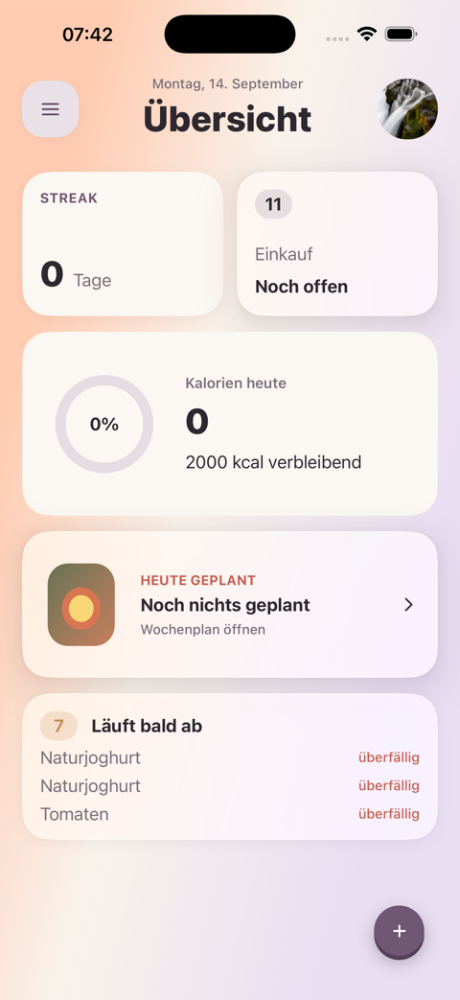
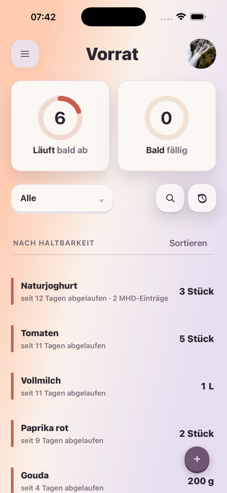
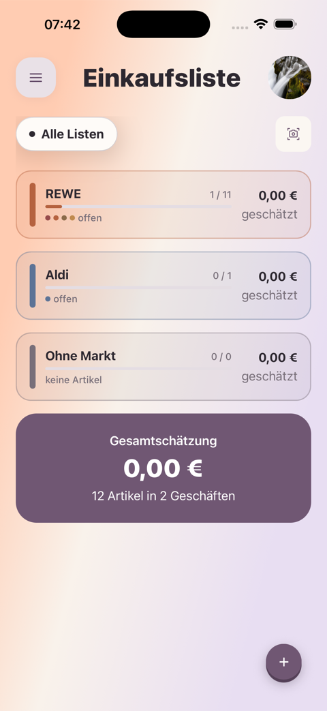
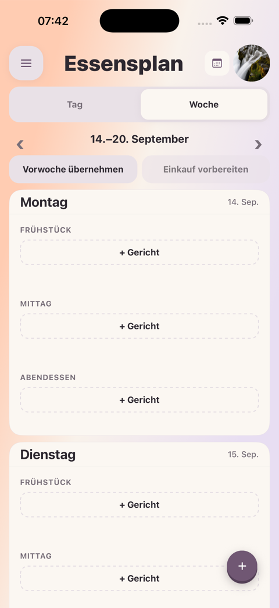
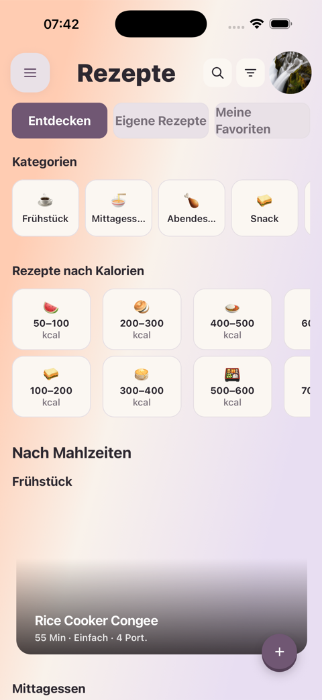

# fam

[](https://github.com/goldjunge91/fam/actions/workflows/ci.yml)
[](https://github.com/goldjunge91/fam/milestones)
[](https://github.com/goldjunge91/fam/issues?q=is%3Aissue+label%3Aepic)

Expo-/React-Native-App für Haushalt, Einkauf und Ernährung: ein geteilter
Kühlschrank-Bestand und eine Einkaufsliste für die ganze Familie, kombiniert
mit privatem Kalorien-, Nährwert- und Gewichts-Tracking pro Account — streng
per Row Level Security getrennt. Mental Anchor: eine datenschutzorientierte,
kollaborative Kombination aus *Bring!* und *MyFitnessPal*.

Details zu Produktentscheidungen und Grenzen: [Produktvision](docs/features/VISION.md).

<p>
  
  
  
  
  
</p>

## Inhalt

- [Status](#status)
- [Gebaut](#gebaut-)
- [Geplant](#geplant-)
- [Erste Schritte](#erste-schritte)
- [Stack](#stack)
- [Dokumentation](#dokumentation)

## Status

Phase 0–2 (Foundation, MVP, Core) sind abgeschlossen. Aktuell laufen
Phase 3 (Advanced) sowie die Vorbereitung des App-Store-Release. Der
verbindliche Überblick über offene Arbeit steht in der
[Roadmap](docs/features/ROADMAP.md); Quelle der Wahrheit für den Stand sind
die [GitHub Milestones](https://github.com/goldjunge91/fam/milestones) und
[Epics](https://github.com/goldjunge91/fam/issues?q=is%3Aissue+label%3Aepic).

## Gebaut ✅

### Phase 0 — Foundation

| Epic | Umfang |
| --- | --- |
| [Foundation: Tooling, Supabase, EAS](https://github.com/goldjunge91/fam/issues/1) | Expo-SDK-57-Setup, Supabase-Projekt, EAS-Build-Konfiguration — Grundlage, bevor Feature-Code sinnvoll ist |
| [Datenmodell & Row Level Security](https://github.com/goldjunge91/fam/issues/2) | Deklaratives Schema (`supabase/schemas/*.sql`) als Source of Truth; strikte RLS-Trennung zwischen geteilten Haushaltsdaten (Kühlschrank, Einkaufsliste) und privaten Nutzerdaten (Kalorien, Gewicht, Ziele) |
| [Offline-Layer & Sync-Engine](https://github.com/goldjunge91/fam/issues/3) | Lokale SQLite-Datenbank mit Outbox-Sync, Realtime-Bridge und Konfliktauflösung nach Last-Write-Wins |

### Phase 1 — MVP

| Epic | Umfang |
| --- | --- |
| [Auth & Onboarding](https://github.com/goldjunge91/fam/issues/4) | Supabase Auth mit E-Mail/Passwort, Session-Persistenz über SecureStore |
| [Haushalt & Familie (Multi-Account)](https://github.com/goldjunge91/fam/issues/5) | Gemeinsamer Haushalt mit Rollen Admin/Mitglied, Einladung per Link/QR-Code, Kinder-Profile ohne eigenen Account |
| [Kühlschrank-Tracker](https://github.com/goldjunge91/fam/issues/6) | Digitaler Bestand für Kühlschrank, Gefrierfach und Vorrat, in Echtzeit für alle Haushaltsmitglieder sichtbar, mit MHD-Tracking und Erinnerungen |
| [Lebensmittel-Datenbank & Barcode](https://github.com/goldjunge91/fam/issues/7) | Open Food Facts gespiegelt in eine eigene `products`-Tabelle, damit Suche und Offline-Zugriff nicht von einem fremden Dienst abhängen |
| [Kalorienziele & Ernährungstagebuch](https://github.com/goldjunge91/fam/issues/8) | Zielberechnung nach Mifflin-St Jeor / Harris-Benedict, Makro-Verteilung, tägliches Tagebuch — privat pro Account |
| [Dashboard & Navigation](https://github.com/goldjunge91/fam/issues/9) | Tab-Struktur, Tagesübersicht, Fortschrittsringe, Modul-Aktivierung |
| [Datenschutz & Compliance](https://github.com/goldjunge91/fam/issues/10) | Datenexport (DSGVO Art. 20), kaskadierende Account-Löschung, Store-Privacy-Labels |

### Phase 2 — Core

| Epic | Umfang |
| --- | --- |
| [Einkaufsliste & Übernahme in den Bestand](https://github.com/goldjunge91/fam/issues/11) | Gemeinsame Liste mit Echtzeit-Abhaken; „Einkauf abschließen" überträgt abgehakte Artikel inklusive Mengen und MHD in den Bestand |
| [Rezept-Manager & Rezept-Builder](https://github.com/goldjunge91/fam/issues/12) | Im Haushalt geteilte Rezeptsammlung mit automatischer Nährwertberechnung aus den Zutaten und Portionsskalierung |

## Geplant 🚧

### Phase 3 — Advanced *(in Arbeit)*

| Epic | Umfang |
| --- | --- |
| [Push-Benachrichtigungen](https://github.com/goldjunge91/fam/issues/14) | Remote Push über `expo-notifications` und Supabase Edge Functions als Trigger |
| [Meal-Planner (Wochenplanung)](https://github.com/goldjunge91/fam/issues/15) | Wochenplanung für den Haushalt, Zuordnung von Mahlzeiten zu Mitgliedern, Drag & Drop |
| [Supermarkt-Preisvergleich](https://github.com/goldjunge91/fam/issues/16) | `PriceProvider`-Abstraktion mit manueller Preiserfassung; echte Kette erst mit offiziellem API-Zugang, da REWE/EDEKA keine öffentlichen APIs anbieten |
| [Intervallfasten-Tracker](https://github.com/goldjunge91/fam/issues/18) | Voreingestellte Protokolle (16:8, 18:6, 20:4, 5:2, OMAD), visueller Countdown, Historie |
| [Kochmodus & „Was kann ich kochen?"](https://github.com/goldjunge91/fam/issues/19) | Kochmodus mit Timern, Vorlesen und Wachhalten des Displays; die KI-Vorschlagsfunktion bleibt bewusst ausgelagert |
| [Rezept-Sharing & Community](https://github.com/goldjunge91/fam/issues/21) | Rezepte über die native Share-Sheet teilen, optionale Freunde-Challenges, anonyme Leaderboards |
| [Premium-Features & Monetarisierung](https://github.com/goldjunge91/fam/issues/23) | RevenueCat-Paywall, Entitlement „Premium" gilt für den gesamten Haushalt, solange ein Mitglied aktiv abonniert hat |
| [Prospekt-/Angebots-Tracking](https://github.com/goldjunge91/fam/issues/121) | Produkt aus dem Prospekt merken, App erinnert am Tag, an dem der jeweilige Markt neue Ware einräumt |

### Phase 4 — Community

| Epic | Umfang |
| --- | --- |
| [Fortschritts-Tracking & Charts](https://github.com/goldjunge91/fam/issues/13) | Gewichtsverlauf, Körpermaße, Kalorienbilanz-Historie mit Trendlinien — bewusst zurückgestellt, um Demotivation bei ausbleibendem Fortschritt zu vermeiden |
| [Aktivitätstracking & Health-Integration](https://github.com/goldjunge91/fam/issues/17) | Schrittzähler über `expo-sensors`, manuelle Aktivitätseingabe mit MET-Werten, Anbindung an HealthKit / Health Connect |
| [Gamification](https://github.com/goldjunge91/fam/issues/20) | Streaks, XP, Kategorie-Level, gestufte Achievements — erst, wenn die Datenbasis stimmt |
| [Ernährungs-Insights & Daten-Export](https://github.com/goldjunge91/fam/issues/22) | Langzeit-Nährstoff-Analysen und Report-Export als CSV/PDF |
| [Homescreen-Widgets](https://github.com/goldjunge91/fam/issues/24) | Native Targets (WidgetKit / Glance) via Config-Plugin, da es kein offizielles Expo-Widget-Paket gibt |
| [UI/UX-Komponenten-System](https://github.com/goldjunge91/fam/issues/122) | Umbau der UI in einen wiederverwendbaren Design-Baukasten |

### App Release *(in Arbeit)*

| Epic | Umfang |
| --- | --- |
| [Apple App Store Release](https://github.com/goldjunge91/fam/issues/317) | Developer Account, Produktionsbuild, App-Privacy, TestFlight bis Store-Veröffentlichung |
| [Google Play Store Release](https://github.com/goldjunge91/fam/issues/316) | Entwicklerkonto, Produktionsbuild, Data Safety, interner Test bis Produktionsfreigabe |

### Ohne festen Meilenstein

| Epic | Umfang |
| --- | --- |
| [Abnehm- & Trainingsmethoden](https://github.com/goldjunge91/fam/issues/179) | Spezifische Protokolle: GLP-1, Fasten, Keto, CGM, Workouts & Energiedichte |
| [Datenpipeline für Supermarkt-Prospekte](https://github.com/goldjunge91/fam/issues/246) | Robuste, deutschlandweite Datenpipeline für mehrere Ketten statt einer einzelnen, undokumentierten Quelle |

Diese Epics sind Produktoptionen, keine fest zugesagten Releases — vor jeder
Umsetzung werden Problem, Datenbedarf und Datenschutzwirkung entschieden
(Details in der [Roadmap](docs/features/ROADMAP.md)).

## Erste Schritte

```bash
bun install
bun start        # Metro starten — 'i' iOS, 'a' Android, 'w' Web
```

Kamera, Barcode-Scanner, lokale SQLite-Datenbank, SecureStore und
Notifications laufen nicht in Expo Go und brauchen einen Dev Client:

```bash
bash scripts/ios-dev.sh
```

Alle weiteren Befehle, Umgebungsvariablen, Test-Accounts, Telemetrie-Setup und
die volle Architektur stehen im [Developer Guide](docs/architecture/DEVELOPER_GUIDE.md).

## Stack

Expo SDK 57 · React Native 0.86 · React 19.2 · Expo Router · Supabase
(Postgres, Auth, Realtime, RLS) · `expo-sqlite` mit Outbox-Sync · TanStack
Query · RevenueCat. Details und Begründungen: [Developer Guide](docs/architecture/DEVELOPER_GUIDE.md#stack).

## Dokumentation

Die vollständige, nach Zweck sortierte Dokumentation steht in
[docs/README.md](docs/README.md). Für Entwicklungsregeln ist
[AGENTS.md](AGENTS.md) verbindlich.
