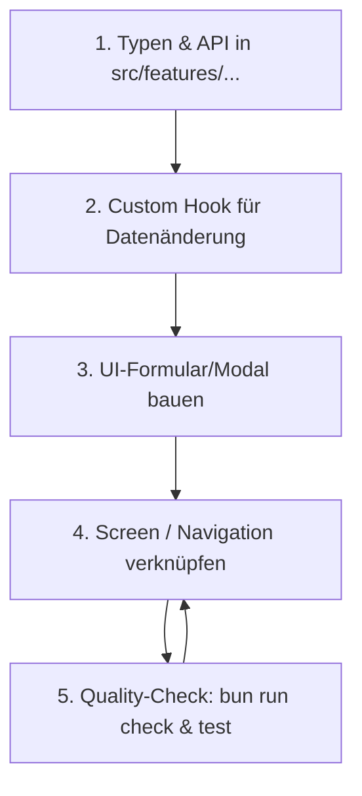

# Developer Guide & Anfänger-Anleitung

Dieses Dokument erklärt die Architektur der **Family App (NutriTrack)**, wie du als Anfänger neue Elemente (UI-Komponenten, Screens, Hooks, Datenbank-Tabellen) hinzufügst und wie du die offenen Punkte der Roadmap schrittweise umsetzt.

---

# 1. Wie der Code funktioniert (Architektur-Übersicht)

Die App ist nach einer modernen **Feature-First-Architektur** mit React Native, Expo Router und Supabase aufgebaut.

### 📁 Die wichtigsten Ordner auf einen Blick

```text
fam/
├── src/
│   ├── app/            # 🚦 NUR Routing & Navigation (Expo Router)
│   ├── features/       # 🧱 Fachlogik nach Themen sortiert (Feature-First)
│   ├── components/     # 🎨 Wiederverwendbare allgemeine UI-Elemente
│   ├── constants/      # 🎨 Theme, Farben, Schriftarten, Abstände
│   ├── hooks/          # 🎣 App-weite React-Hooks (z.B. Theme, Network)
│   └── lib/            # ⚙️ Supabase-Client, Env-Handling, SQLite-Sync
├── supabase/
│   ├── schemas/        # 🗄️ Deklarative Datenbank-Schemas (*.sql)
│   └── tests/          # 🧪 Datenbank-Tests (pgTAP)
└── docs/               # 📖 Status, Roadmap & Vision
```

### 🧠 Die 4 Grundpfeiler des Systems

1. **Routing (`src/app/`)**: Expo Router nutzt **File-based Routing** (ähnlich wie Next.js). Erstellst du eine Datei `src/app/(app)/fridge.tsx`, entsteht automatisch der Screen für den Kühlschrank.
   - `(auth)/`: Screens für nicht eingeloggte Nutzer (Login, Register).
   - `(app)/`: Hauptanwendung mit Tab-Leiste (Kühlschrank, Rezept, Profil, etc.).

2. **Feature-Ordner (`src/features/<domain>/`)**: Die eigentliche Fachlogik liegt nicht in `src/app/`, sondern isoliert im jeweiligen Feature-Ordner. Ein typisches Feature (z.B. `fridge`) sieht so aus:
   - `components/`: UI-Bausteine nur für dieses Feature (z.B. `FridgeItemCard.tsx`).
   - `hooks/`: Daten-Hooks (z.B. `useFridgeItems.ts`).
   - `api.ts`: API-Aufrufe an Supabase / SQLite.
   - `types.ts`: TypeScript-Typen für dieses Feature.

3. **Styling & Theme (`src/constants/theme.ts`)**: In React Native wird mit standardmäßigem `StyleSheet.create({...})` gearbeitet. Farben und Abstände importierst du aus [`theme.ts`](file:///Users/marco/Github.tmp/family_app/fam/src/constants/theme.ts) (`Colors.light.accent`, `Spacing.three`).

4. **Datenbank & Offline-Sync (Supabase + SQLite)**:
   - **Regel laut [`AGENTS.md`](file:///Users/marco/Github.tmp/family_app/fam/AGENTS.md)**: Das Datenbank-Schema wird **ausschließlich deklarativ** unter `supabase/schemas/*.sql` bearbeitet. Du schreibst Migrationen niemals per Hand!
   - Die lokale SQLite-Datenbank sorgt dafür, dass die App auch ohne Internetverbindung funktioniert. Eine Outbox-Sync-Engine synchronisiert Änderungen im Hintergrund mit Supabase.

---

# 2. Schritt-für-Schritt: Wie füge ich als Anfänger neue Elemente ein?

### Fall A: Eine neue UI-Komponente erstellen

Nehmen wir an, du möchtest eine **Badge-Komponente** erstellen, die das Ablaufdatum eines Kühlschrank-Artikels farbig anzeigt.

1. Erstelle die Datei `src/features/fridge/components/ExpirationBadge.tsx`:
```tsx
import React from 'react';
import { StyleSheet, Text, View } from 'react-native';
import { Colors, Spacing } from '@/constants/theme';

interface ExpirationBadgeProps {
  daysLeft: number;
}

export function ExpirationBadge({ daysLeft }: ExpirationBadgeProps) {
  // Bestimme die Farbe nach MHD-Ampel
  const isExpired = daysLeft <= 0;
  const isWarning = daysLeft > 0 && daysLeft <= 3;
  
  const backgroundColor = isExpired 
    ? Colors.light.danger 
    : isWarning 
    ? Colors.light.warning 
    : Colors.light.success;

  return (
    <View style={[styles.badge, { backgroundColor }]}>
      <Text style={styles.text}>
        {isExpired ? 'Abgelaufen' : `${daysLeft} Tage`}
      </Text>
    </View>
  );
}

const styles = StyleSheet.create({
  badge: {
    paddingHorizontal: Spacing.two,
    paddingVertical: Spacing.half,
    borderRadius: 8,
  },
  text: {
    color: '#ffffff',
    fontSize: 12,
    fontWeight: 'bold',
  },
});
```

---

### Fall B: Einen neuen Screen / eine neue Seite hinzufügen

Möchtest du eine neue Seite anlegen (z.B. "Rezept erstellen" unter `(app)/recipes/create.tsx`):

1. Erstelle die Datei `src/app/(app)/recipes/create.tsx`:
```tsx
import React from 'react';
import { StyleSheet, Text, View } from 'react-native';
import { Colors, Spacing } from '@/constants/theme';

export default function CreateRecipeScreen() {
  return (
    <View style={styles.container}>
      <Text style={styles.title}>Neues Rezept erstellen</Text>
    </View>
  );
}

const styles = StyleSheet.create({
  container: {
    flex: 1,
    padding: Spacing.three,
    backgroundColor: Colors.light.background,
  },
  title: {
    fontSize: 24,
    fontWeight: 'bold',
    color: Colors.light.text,
  },
});
```
*Expo Router registriert den Pfad `/recipes/create` automatisch!*

---

### Fall C: Einen Daten-Hook (TanStack Query) anlegen

Wenn du Daten aus der Datenbank laden willst:

1. Erstelle `src/features/fridge/hooks/useFridgeItems.ts`:
```ts
import { useQuery } from '@tanstack/react-query';
import { fetchFridgeItems } from '../api';

export function useFridgeItems(householdId: string) {
  return useQuery({
    queryKey: ['fridgeItems', householdId],
    queryFn: () => fetchFridgeItems(householdId),
    enabled: Boolean(householdId),
  });
}
```

---

### Fall D: Ein neues Feld oder eine neue Tabelle in der Datenbank anlegen

> [!IMPORTANT]
> Beachte die goldene Regel aus [`AGENTS.md`](file:///Users/marco/Github.tmp/family_app/fam/AGENTS.md): Ändere **niemals** direkt Migrationsdateien per Hand!

1. Öffne die passende Schemadatei unter `supabase/schemas/` (z.B. `08_inventory.sql`) und füge die neue Tabelle oder Spalte im SQL-Endzustand ein.
2. Generiere die Migration automatisch über das Terminal:
   ```bash
   bun run db:diff -- -f spalte_hinzugefuegt
   ```
3. Wende die Änderungen lokal an:
   ```bash
   bun run db:reset
   ```
4. Prüfe, ob Schema und Migrationen identisch sind (Diff muss danach leer sein):
   ```bash
   bun run db:diff
   ```

---

# 3. Anleitung: Wie setze ich die noch offenen Punkte selber um?

Im Dokument [`docs/projekt_status.md`](file:///Users/marco/Github.tmp/family_app/fam/docs/projekt_status.md) findest du die genaue Aufschlüsselung aller offenen Punkte.

### Die nächsten Kern-Aufgaben (Meilensteine):

1. **Epic 4 — Haushalt & Familie**:
   - Issue `#59`: Haushalt erstellen (die DB-Funktion `create_household` existiert bereits in `03_households.sql`).
   - Issue `#61/#62`: Einladung per QR-Code / Link generieren & beitreten.
2. **Epic 5 — Kühlschrank-Tracker**:
   - Issue `#68`: Artikel manuell hinzufügen.
   - Issue `#69`: Artikel bearbeiten / als verbraucht markieren.
   - Issue `#71`: Ablauf-Ampel nach MHD sortieren.
3. **Epic 7 — Kalorienziele & Tagebuch**:
   - Formeln für Grundumsatz/TDEE (`#81`, `#82`).
   - Tagebuch-Screen nach Mahlzeiten (`#85`).

---

### Standard-Rezept zur Umsetzung eines neuen Features

Wenn du dir eine Aufgabe (z.B. **Issue #68 — Artikel manuell hinzufügen**) vornimmst, gehst du in folgenden 5 Schritten vor:



#### Schritt 1: Typen definieren (`types.ts`)
Definiere die Eingabedaten für deine Komponente in `src/features/inventory/types.ts`:
```ts
export interface AddFridgeItemInput {
  householdId: string;
  name: string;
  quantity: number;
  unit: string;
  expiresAt?: string;
  storageLocationId: string;
}
```

#### Schritt 2: API & Hook schreiben (`api.ts` & `hooks/useAddFridgeItem.ts`)
In `src/features/inventory/api.ts` rufst du Supabase/SQLite auf:
```ts
import { supabase } from '@/lib/supabase';
import { AddFridgeItemInput } from './types';

export async function addFridgeItem(input: AddFridgeItemInput) {
  const { data, error } = await supabase
    .from('fridge_items')
    .insert(input)
    .select()
    .single();

  if (error) throw error;
  return data;
}
```

In `src/features/inventory/hooks/useAddFridgeItem.ts`:
```ts
import { useMutation, useQueryClient } from '@tanstack/react-query';
import { addFridgeItem } from '../api';

export function useAddFridgeItem() {
  const queryClient = useQueryClient();

  return useMutation({
    mutationFn: addFridgeItem,
    onSuccess: () => {
      // Invalidiere den Cache, damit der Kühlschrank sich automatisch neu lädt
      queryClient.invalidateQueries({ queryKey: ['fridgeItems'] });
    },
  });
}
```

#### Schritt 3: UI-Formular erstellen
Baue das Formular unter `src/features/inventory/components/AddItemForm.tsx` unter Verwendung von TextInput, Buttons und deinen Styles aus `theme.ts`.

#### Schritt 4: Screen / Modal verknüpfen
Binde deine Komponente in `src/app/add-item.tsx` ein.

#### Schritt 5: Testen & Prüfen
Führe vor jedem Commit folgende Befehle im Terminal aus:
```bash
bun run check:fix   # Code-Formatierung und Linter
bun run typecheck   # TypeScript Typ-Prüfung
bun run test        # Unit Tests
```

---

# Nützliche Terminal-Befehle für deinen Entwickler-Alltag

| Befehl | Zweck |
|---|---|
| `bun start` | Startet den Metro-Bundler für Entwicklung |
| `bash scripts/ios-dev.sh` | Vorbereiten & Starten des nativeren iOS Dev-Builds |
| `bun run check:fix` | Formatierer (Biome) automatisch ausführen |
| `bun run typecheck` | Prüft, ob Fehler in Typen vorliegen |
| `bun run test` | Jest Tests ausführen |
| `supabase status` | Status deiner lokalen Supabase-Datenbank |
| `bun run db:diff -- -f name` | Neue Datenbank-Migration aus Schemas erzeugen |
| `bun run db:reset` | Lokale Datenbank zurücksetzen und Migrationen neu anwenden |
