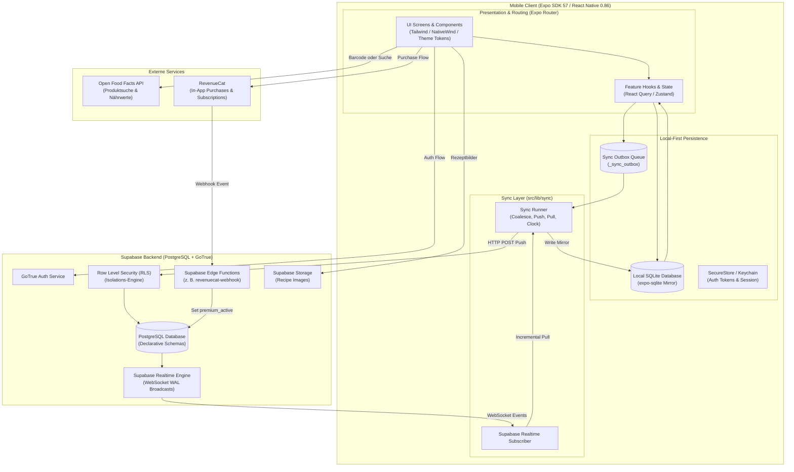
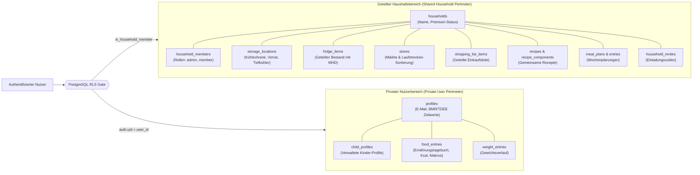
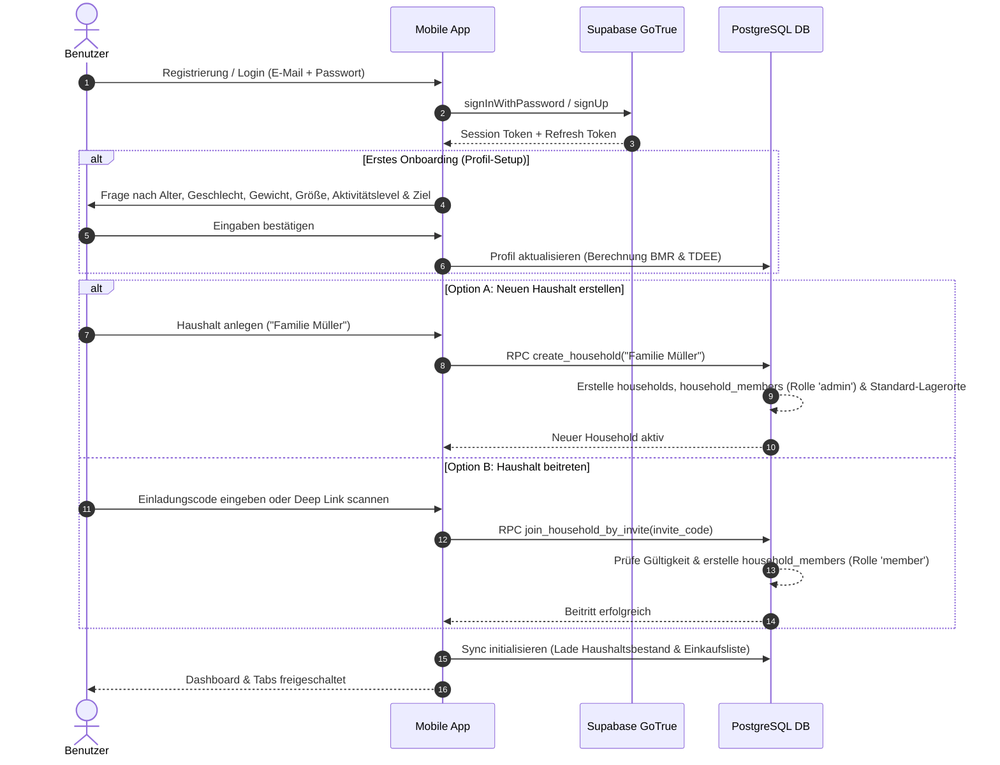
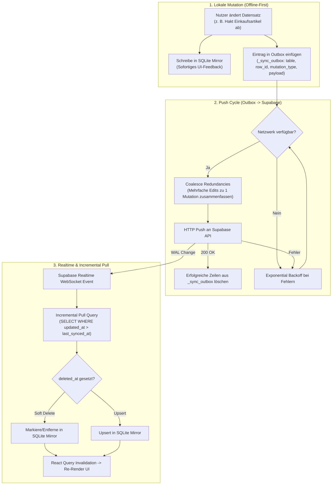
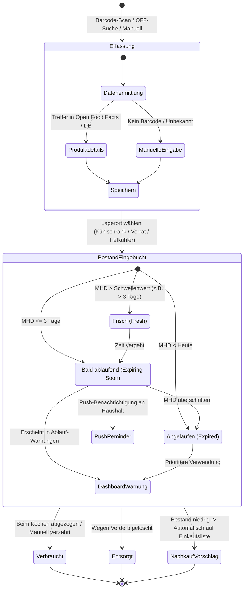
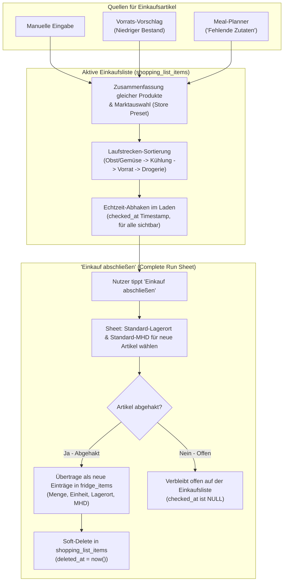
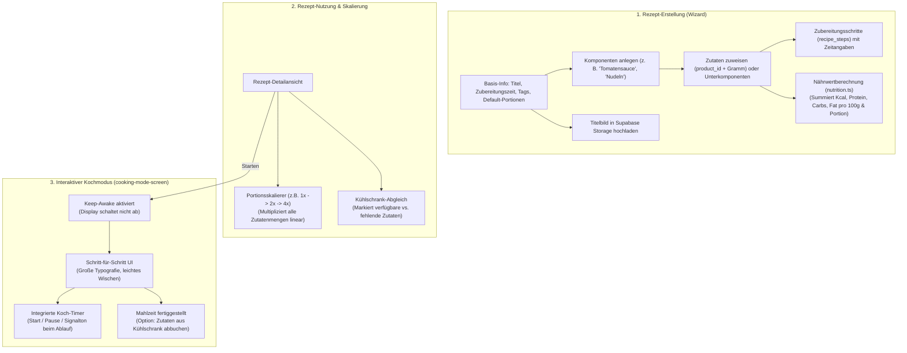
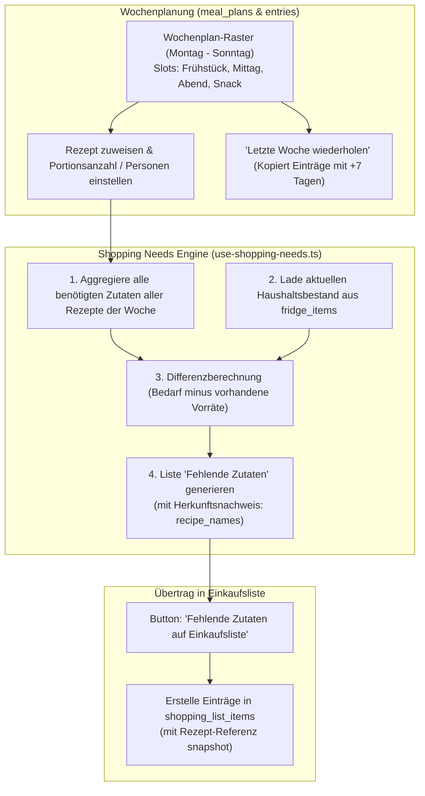
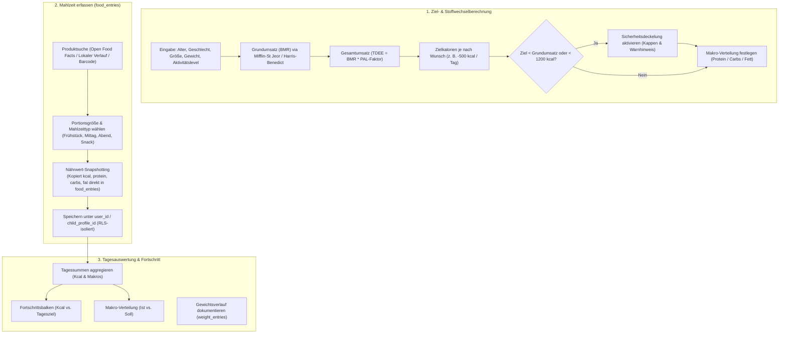
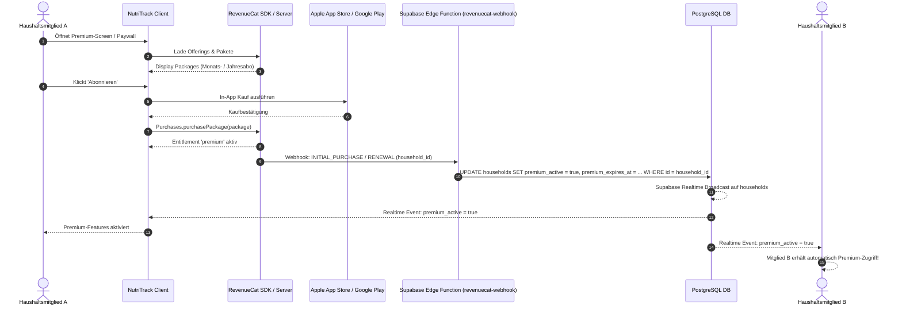

# NutriTrack — Funktions- und Architekturdiagramme

Diese Dokumentation bietet eine visuelle Übersicht über die Systemarchitektur, Datenmodelle, Workflows und Sicherheitsgrenzen der **NutriTrack (`fam`)** App.

---

## 1. System- & Schichtenarchitektur (High-Level Overview)

NutriTrack folgt einem **Local-First / Offline-First** Ansatz auf Basis von Expo (React Native) und SQLite, synchronisiert über eine Outbox-Engine mit Supabase.

---

## 2. Datentrennungs- & RLS-Sicherheitsmodell

Kernpfeiler von NutriTrack ist die strikte Trennung von **geteilten Haushaltsdaten** und **privaten Gesundheitsdaten** auf Datenbankebene (Supabase Row Level Security). Selbst Haushalts-Administratoren haben keinen Zugriff auf private Trackingdaten anderer Mitglieder.

---

## 3. Authentifizierung, Onboarding & Haushalts-Lifecycle

Der Benutzerfluss von der ersten Registrierung über das Profil-Onboarding bis zur Erstellung oder dem Beitritt eines Haushalts.

---

## 4. Local-First Sync Engine & Offline-Pipeline

Änderungen in der App werden unmittelbar lokal in SQLite ausgeführt (**Optimistic UI**) und in der Outbox-Tabelle abgelegt. Der Background Sync Runner sorgt für Batching, Push und Realtime-Aktualisierung.

---

## 5. Kühlschrank- & Vorratsverwaltung (Inventory & Expiry)

Lebensmittel werden strukturiert erfasst, Lagerorten zugewiesen und automatisch nach ihrem Mindesthaltbarkeitsdatum (MHD) priorisiert.

---

## 6. Einkaufslisten-Workflow & Supermarkt-Laufstrecke

Die Einkaufsliste bündelt Bedarfe aus verschiedenen Quellen, sortiert sie nach der physischen Laufstrecke des gewählten Marktes und transferiert abgehakte Artikel beim Abschluss automatisch in den Vorrat.

---

## 7. Rezept-Baukasten & Kochmodus

Rezepte basieren auf einem flexiblen Baukastensystem (Komponenten & Unterkomponenten). Nährwerte werden automatisch errechnet und der Kochmodus unterstützt das Kochen durch Wake-Lock und integrierte Timer.

---

## 8. Wochen-Mahlzeitenplaner & Shopping Needs Engine

Der Mahlzeitenplaner verknüpft Rezepte mit der Kalenderwoche und ermittelt automatisch den Einkaufsbedarf unter Berücksichtigung der im Haushalt vorhandenen Vorräte.

---

## 9. Privates Ernährungstagebuch & Makro-Tracking

Individuelles Tracking für Kalorien, Makronährstoffe und Körpergewicht mit striktem Datenschutz und gesundheitlichen Sicherheitsgrenzen.

---

## 10. Monetarisierung & Haushalts-Premium-Sharing

NutriTrack implementiert ein **familienfreundliches Shared-Entitlement**: Sobald *ein* Mitglied des Haushalts ein aktives Premium-Abo besitzt, wird Premium serverseitig für den gesamten Haushalt freigeschaltet.

