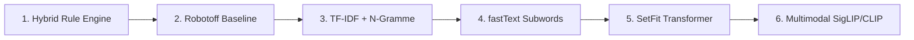

# Einkaufsbereichs-Klassifikation & ML-Pipeline: Architektur, Handelspsychologie und Systemdesign

Status: Verbindliche Gesamtdokumentation  
Version: 1.0  
Stand: 2026-08-25  
Geltungsbereich: Einkaufslisten-Klassifikation, Supermarkt-Laufstrecken, ML- & Evaluations-Pipeline, Category Lab, Alpha-Feedback-Datenerfassung.

---

## 1. Executive Summary

Die Kernfunktion der Einkaufsliste in dieser App ist die automatische, intelligente und kontextsensitive Gruppierung von Artikeln entlang des realen Supermarkt-Laufwegs.

Klassische Einkaufslisten-Apps scheitern an der Realität des Einzelhandels, weil sie Produkte in starre 1-dimensionale Kategorien pressen oder alphabetisch sortieren. Dies führt im Markt zu ständigen Rückwegen und Suchzeiten.

Dieses System löst das Problem durch vier Grundpfeiler:

1. **Das 3-Dimensionen-Modell:** Strikte Trennung zwischen *Produktfamilie* (Was ist es?), *Produktform* (In welchem Zustand/welcher Verpackung liegt es vor?) und *Einkaufsbereich / Placement Zone* (Wo sucht man es im Markt?).
2. **Das 27-Zonen-Modell (`placement-taxonomy-v2`):** Eine anerkannte, handelspsychologisch fundierte Zonenstruktur entlang des natürlichen Einkaufsflusses, kombiniert mit marktindividuellen Sortierfolgen (`stores.category_order`).
3. **Die ML- & Evaluations-Pipeline:** Eine interne Trainings- und Prüfstrecke im Category Lab (`tools/category-debugger`) basierend auf 406.802 realen Open-Food-Facts-Produkten, einer Gold-/Silver-/Bronze-Datenhierarchie, blindem Review und einer Modell-Progression von regelbasierter Evidence Fusion bis hin zu Subword- und Transformer-Modellen.
4. **Die geschlossene Alpha-Feedback-Architektur:** Stille, datenschutzkonforme Erfassung von realen Nutzerkorrekturen (`manual_reassign`, `reset_to_automatic`) über SQLite-Outbox, Push-Only Supabase RLS, HMAC-SHA256-Pseudonymisierung und ein isoliertes Evaluations-Backend. **Eiserne Regel:** Kein Rohsignal wird jemals automatisch zu einer globalen Regel, einem Goldlabel oder Trainingsmaterial.

---

## 2. Motivation & Handelspsychologie (Das „Warum & Wieso“)

### 2.1 Das Problem klassischer Einkaufslisten-Apps

Bestehende Lösungen (wie *Bring!* oder generische Notiz-Apps) verwenden flache Kategorielisten (z. B. „Obst & Gemüse“, „Konserven“, „Milchprodukte“, „Drogerie“). In der Praxis führt dies zu gravierenden Problemen:

- **Kreuz-und-Quer-Laufen:** Nutzer werden gezwungen, zwischen verschiedenen Gängen hin- und herzulaufen, weil die Liste nicht der räumlichen Anordnung des Marktes entspricht.
- **Kategoriensalat durch semantische Kollisionen:**
  - *TK-Brombeeren* landen unter „Obst“, befinden sich aber physisch in der Tiefkühltruhe am anderen Ende des Marktes.
  - *Passierte Tomaten* oder *Tomatenmark* landen unter „Gemüse“, stehen im Markt aber bei den Nudeln.
  - *Eingelegter Salat im Glas* landet bei „Salat/Gemüse“, steht aber im Konservengang.
  - *H-Milch / Haferdrink* landet bei Frischmilch im Kühlregal, steht aber im ungekühlten Trockensortiment oder bei den Getränken.
- **Marktunterschiede werden ignoriert:** Discounter (z. B. Aldi, Lidl) haben grundlegend andere Ganglayouts als Vollsortimenter (z. B. Edeka, Rewe). Ein weltweit starrer „Laufweg“ existiert nicht.

### 2.2 Erkenntnisse der Handelspsychologie & Kundenlaufstudien

Supermärkte werden nach wissenschaftlich und empirisch optimierten Layouts geplant (*Wharton RFID-Kundenlaufstudie Larson/Bradlow/Fader*, *Paco Underhill*, *Herb Sorensen*, *EHI Retail Institute*):

```text
EINGANG
   │
   ▼
[ 1. Frischezone (Obst & Gemüse) ] ──► Signal für Frische, Gesundheit & Qualität
   │
   ▼
[ 2. Bäckerei / Backstation ]      ──► Duftstimulation regt Appetit und Kaufbereitschaft an
   │
   ▼
[ 3. Frischetheken & Kühlwand ]    ──► Molkerei, Käse, Fleisch, Fisch (Perimeter / Außenring)
   │
   ▼
[ 4. Mittelgänge (Center Aisles) ] ──► Trockensortiment, Nudeln, Reis, Konserven, Gewürze
   │
   ▼
[ 5. Getränke & Non-Food ]         ──► Schwere Gebinde, Drogerie, Haushalt
   │
   ▼
[ 6. Tiefkühlbereich ]             ──► Am Ende des Einkaufs, um die Kühlkette zu schützen
   │
   ▼
[ 7. Süßwaren & Impulszone ]       ──► Quengelzone vor den Kassen
   │
   ▼
KASSE / AUSGANG
```

- **Perimeter vs. Center Aisle:** Rund 80 % des Umsatzes und der Einkaufszeit entfallen auf den äußeren Ring (Perimeter: Obst, Gemüse, Backwaren, Molkerei, Fleisch). Die Mittelgänge werden gezielt und punktuell angesteuert.
- **Kühlkettenschutz:** Tiefkühlprodukte werden von Kunden ganz bewusst erst kurz vor dem Bezahlvorgang eingepackt. Eine Einkaufsliste darf Tiefkühlwaren niemals am Anfang auflisten.
- **Assoziationsplatzierung:** Nudeln und Tomatenprodukte (Saucen, Pesto, Tomatenmark) werden im modernen Handel meist in direkter Nachbarschaft platziert, während Reis und Hülsenfrüchte oft im internationalen Regal oder bei Grundnahrungsmitteln stehen.

### 2.3 Das 3-Dimensionen-Modell

Um die semantischen Kollisionen aufzulösen, unterscheidet das System strikt zwischen drei Merkmalen:

```text
┌────────────────────────────────┐
│         ProductFamily          │  Was ist das Produkt biologisch/funktional?
│ z. B. fruit, milk, condiment   │
└───────────────┬────────────────┘
                │
                ▼
┌────────────────────────────────┐
│          ProductForm           │  In welcher Verkaufsform/Zustand liegt es vor?
│ z. B. fresh, ambient, frozen   │
└───────────────┬────────────────┘
                │
                ▼
┌────────────────────────────────┐
│         PlacementZone          │  In welchem Marktbereich wird es einsortiert?
│ z. B. fresh_produce, frozen    │
└────────────────────────────────┘
```

#### Reale Praxisbeispiele

| Produkt | ProductFamily | ProductForm | Resultierende PlacementZone |
| :--- | :--- | :--- | :--- |
| **Frische Brombeeren** | `fruit` | `fresh` | `fresh_produce` (Obst & Gemüse) |
| **TK-Brombeeren** | `fruit` | `frozen` | `frozen` (Tiefkühl) |
| **H-Milch** | `milk` | `ambient` | `ambient_milk_drinks` (Haltbare Milch & Drinks) |
| **Frische Vollmilch** | `milk` | `chilled` | `chilled_dairy_eggs` (Milchprodukte & Eier) |
| **Ungekühlter Haferdrink** | `plant_drink` | `ambient` | `ambient_milk_drinks` (Haltbare Milch & Drinks) |
| **Gekühlter Haferdrink** | `plant_drink` | `chilled` | `chilled_plant_based` (Vegane Kühlprodukte) |
| **Passierte Tomaten (Tetra Pak)** | `tomato_products` | `ambient` | `pasta_tomato` (Nudeln & Tomatenprodukte) |
| **Kopfsalat** | `vegetables` | `fresh` | `fresh_produce` (Obst & Gemüse) |
| **Salat im Glas (eingelegt)** | `vegetables` | `canned_jarred` | `canned_jars` (Konserven & Gläser) |
| **Kokosmilch in der Dose** | `cooking_base` | `canned_jarred` | `canned_jars` (Konserven & Gläser) |
| **Kokosdrink im Karton** | `plant_drink` | `ambient` | `ambient_milk_drinks` (Haltbare Milch & Drinks) |

### 2.4 Trennung von Taxonomie und Markt-Laufstrecke

Die Zuordnung eines Artikels zu einer `PlacementZone` ist global (ein Haferdrink bleibt ein `ambient_milk_drinks`). Die **Reihenfolge** der Zonen ist jedoch flexibel:

- **Default-Laufweg:** Die kanonische Reihenfolge (Ränge 10 bis 270) bildet den typischen Standard-Supermarkt ab.
- **Store-spezifischer Laufweg:** Für jeden Markt (`stores`) kann eine individuelle Reihenfolge über `category_order` definiert werden.
- **Store-spezifische Präferenzen:** Platziert ein spezifischer Markt Ketchup ausnahmsweise beim Fleisch/Grillregal statt bei den Saucen, kann dies als `store_id`-gebundene Präferenz hinterlegt werden, ohne andere Märkte oder Haushalte zu beeinflussen.

---

## 3. Die 27 Einkaufsbereiche (`placement-taxonomy-v2`)

Die Taxonomie `placement-taxonomy-v2` ist in `src/features/shopping-list/classification/placement-taxonomy.ts` als React-freie, typensichere Single Source of Truth definiert.

### 3.1 Zonen-Übersicht

| Rang | ID (`PlacementZoneId`) | Label | Farbe | Standard-Lagerort |
| ---: | :--- | :--- | :--- | :--- |
| 10 | `fresh_produce` | Obst & Gemüse | `#748C5B` | `fridge` |
| 20 | `bakery` | Brot & Backwaren | `#C6A24A` | `pantry` |
| 30 | `chilled_dairy_eggs` | Milchprodukte & Eier | `#5C7396` | `fridge` |
| 40 | `ambient_milk_drinks` | Haltbare Milch, Pflanzendrinks & Kochsahne | `#7B86A5` | `pantry` |
| 50 | `chilled_plant_based` | Vegane Kühlprodukte | `#6B8756` | `fridge` |
| 60 | `meat_poultry` | Fleisch & Geflügel | `#A6483D` | `fridge` |
| 70 | `fish_seafood` | Fisch & Meeresfrüchte | `#457287` | `fridge` |
| 80 | `deli` | Käse, Aufschnitt & Feinkost | `#964B4B` | `fridge` |
| 90 | `pasta_tomato` | Nudeln & Tomatenprodukte | `#B5623F` | `pantry` |
| 100 | `rice_world_foods` | Reis, Getreide & Hülsenfrüchte | `#8B6B4A` | `pantry` |
| 110 | `breakfast` | Frühstück & Brotaufstriche | `#C08A4E` | `pantry` |
| 120 | `baking` | Backen & Grundzutaten | `#B89462` | `pantry` |
| 130 | `oils_spices` | Öle, Essig & Gewürze | `#B57B48` | `pantry` |
| 140 | `condiments` | Ketchup, Senf & Würzsaucen | `#A95745` | `pantry` |
| 150 | `canned_jars` | Konserven & Gläser | `#9B604A` | `pantry` |
| 160 | `ready_meals` | Fertiggerichte & Suppen | `#9B7864` | `pantry` |
| 170 | `snacks` | Snacks & Nüsse | `#8B6F72` | `pantry` |
| 180 | `sweets` | Süßwaren | `#A16A82` | `pantry` |
| 190 | `cold_drinks` | Wasser, Saft & Softdrinks | `#4F8580` | `fridge` |
| 200 | `hot_drinks` | Kaffee, Tee & Kakao | `#6A564A` | `pantry` |
| 210 | `alcohol` | Alkohol | `#7B5D6E` | `pantry` |
| 220 | `frozen` | Tiefkühl | `#6C7F99` | `freezer` |
| 230 | `baby` | Baby | `#8C6C82` | `pantry` |
| 240 | `pets` | Tierbedarf | `#736B5E` | `pantry` |
| 250 | `household` | Haushalt & Reinigung | `#5A6F7C` | `pantry` |
| 260 | `personal_care` | Drogerie & Körperpflege | `#705773` | `pantry` |
| 270 | `other` | Sonstiges | `#786F79` | `pantry` |

### 3.2 Effektive Auflösungskaskade (Local-First)

Bei der Bestimmung der sichtbaren Zone eines Listeneintrags durchläuft das System folgende Prioritätskette:

```text
┌────────────────────────────────────────────────────────┐
│ 1. Globale Klassifikation                              │
│    (Rule Engine / Evidence Fusion / Offline Classifier)│
└───────────────────────────┬────────────────────────────┘
                            │ (Fallback-Basis)
                            ▼
┌────────────────────────────────────────────────────────┐
│ 2. Haushalts-Präferenz (`store_id IS NULL`)            │
│    (Benutzerdefinierte Regel für den gesamten Haushalt)│
└───────────────────────────┬────────────────────────────┘
                            │ (Überschreibt Basis)
                            ▼
┌────────────────────────────────────────────────────────┐
│ 3. Store-Präferenz (`store_id = currentStore.id`)      │
│    (Marktspezifische Zuordnung für diesen Laden)       │
└───────────────────────────┬────────────────────────────┘
                            │ (Höchste Priorität)
                            ▼
┌────────────────────────────────────────────────────────┐
│ 4. Lokaler Item-Snapshot                               │
│    (Explizite Wahl im Einkaufslisten-Eintrag)          │
└────────────────────────────────────────────────────────┘
```

---

## 4. Die ML- & Evaluations-Pipeline

Die Pipeline dient der systematischen Entwicklung, Messung und kontinuierlichen Verbesserung der automatischen Klassifikation.

### 4.1 Datenfundament

- **Open Food Facts Voll-Dump:** Lokale Datenbank (`products_de.db`) mit 406.802 realen deutschen Produkten, inklusive Barcode, Produktname, Marke, Zutaten, Nährwerten und hierarchischen `categories_tags`.
- **Bildmanifest & Frontbilder:** `image-manifest.ts` extrahiert die echten Frontbild-Referenzen aus dem OFF-Dump (`selected_images` bzw. `images.front_de`) und ermöglicht die lokale Inspektion von Verpackungen.

### 4.2 Die 3-Stufen-Datenqualitätshierarchie

Um Modell-Degeneration und Trainingskontamination zu verhindern, werden Daten in drei strikt getrennte Klassen eingeteilt:

```text
           ▲
          / \     GOLD: Menschlich geprüfter Ground Truth
         /   \    (Holdout, Golden Corpus - 0 % KI-Kontamination)
        / GOLD\
       /───────\
      /         \   SILVER: LLM-Konsens & Batch-Annotationen
     /  SILVER   \  (OpenAI Batch API, Structured Outputs, Multimodal)
    /─────────────\
   /               \  BRONZE: Heuristiken, Regex, OFF-Roh-Tags
  /     BRONZE      \ (Dump-Metadaten, unkuratierte Signale)
 /───────────────────\
```

1. **Bronze (Basis-Signale):** Heuristische Keywords, Wortlisten und unbereinigte Open-Food-Facts-Tags. Schnelle Abdeckung, jedoch ca. 37 % interne Widersprüche zwischen Tags und Namen.
2. **Silver (LLM-Konsens & synthetische Labels):** Massen-Labeling über LLMs (z. B. GPT-4o-mini via OpenAI Batch API) mit striktem JSON-Schema (`Structured Outputs`). Eingabedaten: Name, Marke, Zutaten, Nährwerte und Bild. Silver-Labels dienen als gewichtetes Trainingsmaterial, aber **niemals** als Evaluations-Holdout.
3. **Gold (Menschlicher Ground Truth):** Handverlesene, im Blind-Review bestätigte Produkte. Aufgeteilt in:
   - `Golden Corpus` (ca. 50-100 kritische Regressionstests).
   - `Calibration Set` (zur iterativen Regelanpassung).
   - `Holdout Set` (unangetasteter Testdatensatz zur neutralen Erfolgsmessung).

### 4.3 Modell-Baselines & Progression

Das System evaluiert mehrere algorithmische Ansätze gegeneinander:



1. **Hybrid Rule Engine mit Evidence Fusion (Aktueller Standard):**
   - *Aisle-Defining Markers:* Explizite Zustandsmarker (z. B. `tiefgefroren` mit Priorität 120) überstimmen generische botanische Tags (z. B. `en:blackberries`).
   - *Morphologische Headword-Zerlegung:* Reverse-Trie für deutsche Komposita (`Apfelsaft` -> `Apfel` + `saft`, `Tomatenmark` -> `Tomaten` + `mark`).
   - *Brand-Stripping:* Entfernung bekannter Markennamen vor der morphologischen Analyse.
   - *Tippfehler-Toleranz:* Damerau-Levenshtein für Tokens ab 5 Zeichen mit Distanz $\le 1$.
   - *Margin-Abstention:* Liegen Platz 1 und Platz 2 im Score zu nah beieinander, liefert der Klassifikator bewusst `null` (`other`), um Fehlklassifikationen zu vermeiden.
2. **Robotoff Baseline:** Mapping der Vorhersagen des Open-Food-Facts-Klassifikators auf die 27 Zonen.
3. **Klassisches NLP (TF-IDF + LinearSVC / Logistic Regression):** Schnelle, interpretierbare N-Gramm-Modelle (Wort- und Zeichen-3-5-Gramme).
4. **fastText:** Supervised Subword-Einbettungen, besonders widerstandsfähig gegen deutsche Wortzusammensetzungen und Rechtschreibfehler.
5. **SetFit (Few-Shot Sentence Transformers):** Semantische Ähnlichkeitsmodelle, feinjustiert auf Gold- und Silver-Daten.
6. **Multimodale Bild-Embeddings (SigLIP / CLIP):** Optische Erkennung zur Auflösung mehrdeutiger Verpackungen (z. B. Glas vs. Tetra Pak vs. Dose).

### 4.4 Category Lab & Evaluations-Tool (`tools/category-debugger`)

Das Category Lab ist eine eigenständige Bun/Vite-Webanwendung zur Qualitätskontrolle.

#### 1. Blind-Review-Workflow (Schutz vor Bestätigungsfehlern)

- Der Prüfer sieht Produktname, Marke, Nährwerte und Frontbild.
- Die Vorhersage und der Entscheidungs-Trace des Klassifikators sind **vollständig ausgeblendet**.
- Der Prüfer wählt die Zone oder vergibt den Status `ambiguous` / `invalid`.
- Erst nach dem Speichern werden Vorhersage, Konfidenz und vollständiger Trace angezeigt.

#### 2. Fokussierte Review-Queues

- **Queue „OFF vs. Name Widersprüche“:** 19.657 Dump-Produkte, bei denen Namensregeln und OFF-Tags kollidieren (z. B. `beverages` vs. `produce`).
- **Queue „Gleichstände & No-Signal“:** 12.130 Produkte, die in `Sonstiges` enden.
- **Queue „Stratifizierte Stichprobe“:** Gleichmäßige Stichprobe über alle 27 Zonen.

#### 3. Metriken & Laufstreckengewichteter Fehler

Neben Standardmetriken (Precision, Recall, Macro-F1) wird der **laufstreckengewichtete Distanzfehler** berechnet:

$$\text{Fehlerkosten} = |\text{Rang}_{\text{Soll}} - \text{Rang}_{\text{Ist}}|$$

*Beispiel:* Eine Verwechslung von Molkerei (Rang 30) mit Pflanzendrinks (Rang 40) verursacht geringe Fehlerkosten ($\Delta = 10$). Eine Verwechslung von Obst (Rang 10) mit Tiefkühl (Rang 220) verursacht gravierende Fehlerkosten ($\Delta = 210$).

#### 4. Versionsvergleich

Jeder Lauf vergleicht Version $N$ mit Version $N+1$:

- Neu gewonnene korrekte Fälle (Gains).
- Neu entstandene Fehler (Losses / Regressions).
- Netto-Verbesserung auf dem Holdout-Datensatz.

---

## 5. Die geschlossene Alpha-Feedback-Architektur

Die mobile App sammelt reale Nutzerkorrekturen in einer geschlossenen Feedback-Schleife, ohne den Nutzer im Einkaufsfluss zu behindern und ohne das Produktivsystem zu gefährden.

```text
┌────────────────────────────────────────────────────────┐
│ MOBILE APP (iOS / Android)                             │
│ 1. Nutzer ändert Einkaufsbereich im Edit-Formular     │
│ 2. Atomare lokale SQLite-Transaktion:                  │
│    - Item-Update                                       │
│    - Store-/Haushaltspräferenz-Update                  │
│    - shopping_category_feedback_events (Push-Only)     │
│    - Outbox-Eintrag                                    │
└───────────────────────────┬────────────────────────────┘
                            │ (Push-Sync bei Online-Verbindung)
                            ▼
┌────────────────────────────────────────────────────────┐
│ PRODUKTIV-SUPABASE (App-Backend)                       │
│ - RLS: Authenticated darf nur INSERT ausführen         │
│ - Keine SELECT-/UPDATE-/DELETE-Rechte für Clients      │
│ - Speichert Roh-Events mit Original-IDs                │
└───────────────────────────┬────────────────────────────┘
                            │ (Manuelles ETL-Import-Script)
                            │ (HMAC-SHA256 Pseudonymisierung)
                            ▼
┌────────────────────────────────────────────────────────┐
│ EVALUATION-SUPABASE (Internes Analyse-Backend)         │
│ - evaluation_crowd_signals (pseudonymisiert)           │
│ - Keine direkten User-, Household- oder Store-IDs      │
└───────────────────────────┬────────────────────────────┘
                            │
                            ▼
┌────────────────────────────────────────────────────────┐
│ CATEGORY LAB (Internes Review-Tool)                    │
│ - Aggregation & Konsens-Analyse (Wilson Score)         │
│ - Menschlicher Blind Review                            │
│ - Freigabe für Dataset-Snapshots                       │
│ - Re-Training / Regel-Update -> Neues Release          │
└───────────────────────────┘
```

### 5.1 Stille Alpha-UX (Keine störenden Dialoge)

- **Kein Drag-and-drop / kein Schnell-Picker:** Diese Interaktionen würden im Supermarkt zu Fehlbedienungen führen.
- **Bestehender Edit-Flow:** Tippen auf ein Listenelement öffnet wie gewohnt das Bearbeiten-Formular. Das Feld heißt nun sichtbar „Einkaufsbereich“.
- **Bewusste Aktion:** Ein Event wird nur erzeugt, wenn der Nutzer das Feld aktiv berührt hat (`placementSelectionTouched = true`), eine echte Änderung vorliegt und „Speichern“ gewählt wird.
- **Keine UI-Meldungen:** Keine Snackbars, keine Lernstatus-Anzeigen, kein Sync-Hinweis.

### 5.2 Sicherheit & Datenschutz

- **RLS & Rechte:** Authentifizierte Clients haben ausschließlich `INSERT`-Rechte auf `shopping_category_feedback_events`. Sie können niemals fremde oder eigene historische Feedback-Events lesen.
- **Keine sensiblen Daten:** Freitext-Notizen, Einkaufslistennamen, Haushaltsnamen und Profilnamen werden **nicht** im Feedback-Event gespeichert.
- **HMAC-SHA256 Pseudonymisierung:** Beim Übertrag in die Evaluation-Supabase werden User-IDs, Haushalts-IDs und Store-IDs über einen geheimen Key gehasht. Direkte Identifikatoren verlassen das Produktiv-Backend nicht.

### 5.3 Der Release-Zyklus für neue Klassifikator-Versionen

```text
Rohsignale 
   ──► Aggregation & Konsensprüfung
   ──► Menschlicher Review im Category Lab
   ──► Übernahme in Versionierten Dataset-Snapshot
   ──► Validierung gegen Gold-Holdout (Macro-F1 & Distanzkosten)
   ──► Manuelles Code-Update (`src/.../placement-taxonomy.ts`)
   ──► Neuer App-Release (`placement-v2.x.x`)
```

---

## 6. Zusammenfassung der Architekturverträge

1. **Taxonomie:** `src/features/shopping-list/classification/placement-taxonomy.ts` ist die alleinige Definitionsquelle für 27 Bereiche.
2. **Datenbanken:**
   - App-Supabase: Produktivdaten + `shopping_category_feedback_events` (Insert-Only für Clients).
   - Eval-Supabase: `evaluation_crowd_signals` (Pseudonymisiert, Read-Only für Category Lab).
3. **Offline & Sync:** Feedback-Events sind Push-Only. Sie werden bei SQLite-Transaktionen lokal mitgeführt und über die Outbox synchronisiert.
4. **Qualitätssicherung:** Keine automatische Regelübernahme. Jede Modelländerung muss sich am Holdout-Datensatz beweisen.
