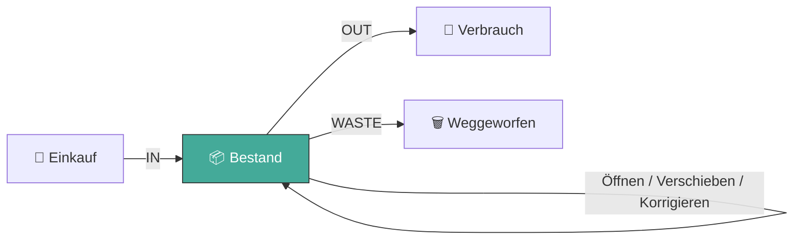
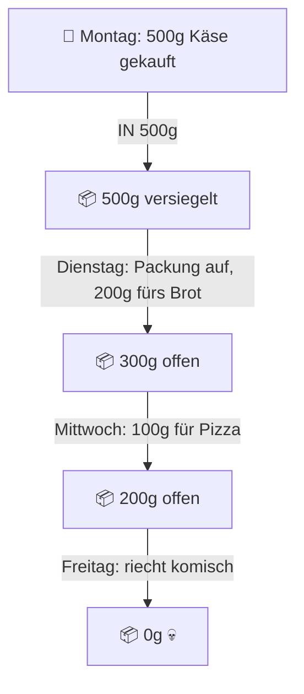

# Inventory Operations Contract

Status: von Marco als fachlicher Zielvertrag freigegeben.
Letzte Festlegung: 2026-09-10.

Dieses Dokument ist die einzige maßgebliche Quelle für fachliche
Lifecycle-Zustände und die technische Ausführung der Inventory-Operationen.

`CONSTRAINTS.md` setzt Arbeits- und Qualitätsgrenzen, `owner-file-map.md` die
statische Ownership und Beads Arbeitsstand, Reihenfolge sowie Nachweise.

---

## 0. Überblick

### Was dieser Refactor erreichen soll

Jede Bestandsänderung im Haushalt ist entweder **rein** (IN), **raus** (OUT)
oder **Müll** (WASTE). Egal ob jemand einkauft, kocht, eine Packung öffnet
oder etwas wegwirft — es soll immer sauber aufgeschrieben werden, auch offline.
Aktuell macht der Code das an zu vielen Stellen gleichzeitig. Das wird auf
einen einzigen, klaren Weg zusammengeführt.



- **IN** = Menge kommt dazu (Einkauf, Undo, Korrektur nach oben)
- **OUT** = Menge geht weg (Kochen, Verbrauch, Korrektur nach unten)
- **WASTE** = Menge geht weg weil abgelaufen/verdorben

Alles andere (Packung öffnen, Lagerort wechseln, rückgängig machen) verändert
den Bestand intern, folgt aber denselben Regeln.

### Beispiel: Eine Packung Käse über die Woche



Die History — eine Zeile pro Ereignis, immer nur angehängt, nie geändert:

| # | Wann | Was | Menge | Bestand danach |
|---|------|-----|-------|----------------|
| 1 | Mo | **IN** — eingekauft | +500g | 500g versiegelt |
| 2 | Di | **OUT** — fürs Brot | −200g | 300g offen |
| 3 | Mi | **OUT** — für Pizza | −100g | 200g offen |
| 4 | Fr | **WASTE** — verdorben | −200g | 0g weg 💀 |

Undo von Zeile 3 löscht nichts, sondern hängt eine Gegenzeile an:

| # | Wann | Was | Menge | Bestand danach |
|---|------|-----|-------|----------------|
| 3 | Mi | **OUT** — für Pizza | −100g | 200g |
| 5 | Mi | **IN** — ↩️ Undo von #3 | +100g | 300g |

### Phasen

| Phase | Operationen | Beschreibung |
|---|---|---|
| **Phase 1** | `insert`, `consume`, `waste`, `move`, `correct` | Kern-Operationen sauber aufstellen |
| **Phase 2** | `open`, `reseal`, `patch_metadata`, `undo` (alle Modi) | Erweiterungen auf dem stabilen Fundament |

Phase 2 baut auf Phase 1 auf. Das bisherige `merge_undo_open` entfällt als
atomare Operation und wird durch zwei separate Undos ersetzt (die UI kann beide
automatisch hintereinander auslösen).

---

## 1. Begriffe

- **Fachliche Aktion:** eine Benutzerabsicht (z. B. „200g Käse verbrauchen").
- **Operation:** ihre vollständige lokale und serverseitige Ausführung.
- **Operation-ID:** stabiler Idempotenzschlüssel — Retries behalten dieselbe ID.
- **Lot (Los):** ein einzelner Bestandseintrag mit eigener ID, Menge und Zustand.
- **Ledger-ID:** stabile ID genau einer History-Zeile.
- **Footprint:** alle Lose und Ledgerzeilen, die eine Operation berührt.
- **Tombstone:** ein leeres Los (`quantity = 0, deleted_at != null`), das seine
  ID und Metadaten behält.
- **Owner:** einziges Produktionsmodul, das eine fachliche Regel entscheidet.
- **CAS-Anker:** Compare-and-Set-Erwartungswert, um gleichzeitige Änderungen zu
  erkennen. Für Mengenänderungen: `expected_quantity`. Stimmt der Serverzustand
  nicht überein → `STALE_BASE`.
- **Öffnungsanteil P:** die Packungsmenge, die bei einem Teilverbrauch aus einem
  versiegelten Bestand geöffnet wird (`P = package_size`). Bei Stückgut `P = 1`;
  bei loser Ware `P = C` (reiner Verbrauch).
- **Fehlercodes:** `STALE_BASE`, `INSUFFICIENT_QUANTITY`,
  `UNDO_WINDOW_EXPIRED`, `DEPENDENT_MUTATION_EXISTS`, `ID_PAYLOAD_MISMATCH`,
  `PAYLOAD_VALIDATION_FAILED`.

---

## 2. Fachliche Lifecycle-Zustände

1. **`versiegelt` (sealed):** Ungeöffnete Packung (`opened_at = null`).
   `expiry_date` = Mindesthaltbarkeitsdatum (MHD).
2. **`geöffnet` (opened):** Angebrochene Packung (`opened_at != null`).
   `expiry_date` = berechnetes oder manuell angepasstes Verbrauchsdatum.
3. **`vakuumiert` (vacuum_sealed):** Geöffnetes Los, durch Vakuumieren
   verlängert haltbar (`vacuum_sealed = true`).
4. **`wieder-versiegelt` (reseal):** Wiederverschließbare Verpackung manuell
   verschlossen. Setzt `opened_at = null`. Kein Ledger, kein Merge.

Übergänge:

- `versiegelt` → `geöffnet`: via `consume_inventory` (mit `opens_remainder`).
  Ab Phase 2 auch via `open_inventory`.
- `geöffnet` → `versiegelt`: ab Phase 2 via `reseal_inventory` oder Undo.
- `geöffnet` → `vakuumiert`: via Metadaten-Patch (`vacuum_sealed = true`).
- `*` → `tombstoned`: bei Vollverbrauch, Vollverderb oder aufgelöstem Restlos.

### Verlauf und Rezeptbezug

- `consume_inventory` akzeptiert optionale Felder `recipe_id`, `recipe_name`,
  `meal_plan_entry_id`.
- Rezeptbezüge sind typisierte Felder im gespeicherten Request. Ledger-Notes
  werden niemals zur Rekonstruktion von Identität oder Provenienz geparst.

### Fachliche Grenzen

- **Keine implizite Einheiten-Magie:** Ohne festen Packungssnapshot
  (`package_size`) wird nie automatisch umgerechnet.
- **Kein Undo nach Folgemutation:** Ein Los mit nachfolgendem Verbrauch kann
  nicht zurückgesetzt werden, ohne vorher die Folgemutationen zurückzunehmen.

---

## 3. Globaler Vertrag

Alle kanonischen Payloads tragen `contract_version = 1`.

1. Die Operation-ID entsteht einmal. Retries behalten alle IDs und denselben
   Payload.
2. Gleiche ID + gleicher Payload → früheres Ergebnis ohne zweite Wirkung.
   Gleiche ID + anderer Payload → `ID_PAYLOAD_MISMATCH`.
3. Bestand, Ledger, Tombstones und Outbox werden lokal atomar geschrieben.
   Dieselbe Operation wird serverseitig atomar committed.
4. Timeout oder Antwortverlust = `unknown`, nicht `failed`. Die Operation
   bleibt mit denselben IDs offen und wird erneut versucht.
5. Ledger ist append-only. Undo erzeugt Gegenbuchungen mit `reversal_of`;
   das Original bleibt unverändert. Die Spalte `transactions.undone` entfällt.
6. Neue Ledgerzeilen verwenden nur `in`, `out` oder `waste`. Der Typ `open`
   entfällt vollständig.
7. `created_at` wird bei der Benutzerabsicht einmal erfasst. Der Server
   leitet `actor` aus `auth.uid()` ab.

Ergebnisse sind `applied`, `conflict` oder `invalid`. Lokal zusätzlich
`unknown` bei Antwortverlust.

---

## 4. Mengen und Tombstones

- Mengen sind Dezimalwerte in der gespeicherten Basis-`unit`:
  `300 g = 300`, `1 Stück = 1`, `0,5 Dose = 0,5`.
- Höchstens eine Nachkommastelle. SQLite `real`, Postgres `numeric(10,1)`.
  Fachlicher Maximalwert: `9_999_999.9`.
- `package_size` wird ebenfalls als Dezimalwert geführt.
- Ein Tombstone hat `quantity = 0` und `deleted_at != null`. ID, Haushalt,
  Produkt und Mengenbasis bleiben erhalten.
- Undo reaktiviert dieselbe Lot-ID.
- Shopping-, Produktkatalog- und Nutrition-Mengen behalten ihre eigene Einheit.
  An der Inventory-Grenze wird einmal normalisiert.

---

## 5. Phase-1-Operationsregister

| Operation | Stabile IDs | Wirkung |
|---|---|---|
| `insert_inventory` | `operation_id`, `item_id`, `in_transaction_id` | Neues Los + `IN quantity` |
| `consume_inventory` | `operation_id`, `out_transaction_id`, `source_item_id`, optional `opened_item_id` | `OUT C`, optionaler Öffnungsrest, möglicher Tombstone |
| `waste_inventory` | `operation_id`, `waste_transaction_id`, `item_id` | `WASTE W`, Grund, möglicher Tombstone |
| `move_inventory` | `operation_id`, `out_transaction_id`, `in_transaction_id`, `item_id` | Lagerortwechsel, zwei Ledgerbeine |
| `correct_quantity` | `operation_id`, `transaction_id`, `item_id` | Compare-and-Set, `IN`- oder `OUT`-Delta |

Jede Operation enthält außerdem `household_id`, `created_at` und den
erwarteten Ausgangszustand.

---

## 6. Verbrauch mit Öffnungsrest (`opens_remainder`)

`consume_inventory` ist eine diskriminierte Union mit drei Varianten:

```text
sealed_full:
  Aus versiegelter Packung, alles verbraucht oder ganze Einheiten.
  source_after = source_before - C
  Kein geöffnetes Restlos.

sealed_partial (opens_remainder):
  Aus versiegelter Packung, nur ein Teil verbraucht. Packung wird dabei
  geöffnet.
  0 < C < P <= source_before
  source_after = source_before - P
  opened_remainder R = P - C
  total_after = source_after + R = source_before - C

opened:
  Aus bereits geöffneter Packung.
  source_after = source_before - C
  Kein weiterer Split.
```

### Beispiel: Erster Teilverbrauch aus versiegeltem Bestand

```text
Vorher:  Versiegelt 500g | Geöffnet 0g
Aktion:  200g für Rezept XYZ verbrauchen
Danach:  Versiegelt 0g (Tombstone) | Geöffnet 300g (neues Los)
Ledger:  OUT 200g, Rezept XYZ
```

Was dabei atomar passiert:

1. Die angebrochene Packung P (500g) verlässt den versiegelten Bestand.
2. Das versiegelte Ursprungslos bekommt einen Tombstone (oder behält den
   Rest, wenn mehrere Packungen vorhanden waren).
3. Ein geöffnetes Los mit R = P − C (300g) entsteht, mit `opened_at` und
   berechnetem `expiry_date`.
4. Im Ledger steht nur die verbrauchte Menge (200g) als `OUT`. Keine
   `open`-Zeile, kein künstlicher `OUT 500 / IN 500`-Transfer.

`sealed_partial` enthält zusätzlich `opened_item_id`, `P`, `R`, `opened_at`,
Haltbarkeitsfelder und eine Provenienz-Referenz auf das Ursprungslos.

Ledger-Zuordnung:

- `sealed_full`: `OUT C.fridge_item_id = source_item_id`
- `sealed_partial`: `OUT C.fridge_item_id = opened_item_id`
- `opened`: `OUT C.fridge_item_id = source_item_id`

---

## 7. Weitere Phase-1-Operationsregeln

- **`insert_inventory`:** Positive Menge; Lot und `IN` entstehen gemeinsam.
- **`waste_inventory`:** `0 < W <= expected_quantity`; Grund ist
  `expired | spoiled | other`; `quantity_after = expected_quantity - W`.
- **`move_inventory`:** Erwartete Menge und alter Ort müssen stimmen; Menge
  und Lot-ID bleiben gleich; beide Ledgerbeine besitzen dieselbe Operations-ID.
  `expected_location_id` und `to_location_id` sind Pflichtfelder. Bestand ohne
  zugewiesenen Lagerort entfällt als Zielzustand (Produktentscheidung
  2026-09-08). Bestehende Zeilen mit `location_id = null` benötigen vor der
  Aktivierung eine einmalige Datenbereinigung.
- **`correct_quantity`:** `new_quantity >= 0` und ungleich Erwartungsmenge;
  Ledger enthält exakt das tatsächliche Delta mit `[Manual correction]`.

---

## 8. Sync und Konfliktauflösung

### Lokaler Schreibpfad (offline-fähig)

1. Benutzer löst eine Aktion aus (z. B. „200g Käse verbrauchen").
2. Operation bekommt eine stabile ID und wird lokal atomar geschrieben:
   Bestand, Ledger und Outbox in einer SQLite-Transaktion.
3. Die UI zeigt sofort den neuen Zustand (optimistisch).
4. Sobald Netz vorhanden, wird die Operation an den Server gesendet.

### Server-Verarbeitung

Der Server prüft Auth, Haushalt und Payload. Dann:

- **Neue Operation-ID:** Preconditions prüfen (CAS, Menge), ausführen,
  Ergebnis speichern, `applied` zurückgeben.
- **Bekannte Operation-ID, gleicher Payload:** Früheres Ergebnis zurückgeben
  (`replayed`), keine zweite Wirkung.
- **Bekannte Operation-ID, anderer Payload:** `ID_PAYLOAD_MISMATCH`.
- **Precondition verletzt:** `conflict` mit Fehlercode, keine Schreibwirkung.
- **Ungültiger Payload:** `invalid`, keine Schreibwirkung.

### Abgleich (Reconciliation) — Phase-1-Modell

Das Phase-1-Modell ist bewusst einfach gehalten:

1. **Push:** Lokale Outbox-Operationen werden der Reihe nach an den Server
   gesendet. Erfolgreiche Operationen werden aus der Outbox entfernt.
2. **Pull:** Der Server liefert den aktuellen Bestand. Dieser wird als
   Basis übernommen. Noch nicht gesendete lokale Operationen werden auf
   die neue Basis projiziert.
3. **Konflikt:** Wenn eine lokale Operation auf dem Server scheitert
   (z. B. `STALE_BASE`), wird der User benachrichtigt und kann entscheiden.
4. **Timeout/Unknown:** Die Operation bleibt in der Outbox und wird erneut
   versucht (mit derselben ID). Ein Retry-Limit begrenzt automatische
   Versuche, macht `unknown` aber nicht zu `conflict`.

Realtime-Events signalisieren, dass neue Serverdaten vorliegen und ein Pull
angestoßen werden soll.

> **Phase-2-Erweiterung:** Receipt-basierte Idempotenz mit konsistenten
> Snapshot-Reads und transaktionaler Reconciliation kann das Phase-1-Modell
> später ersetzen, wenn sich zeigt, dass die einfache Variante bei parallelen
> Offline-Änderungen nicht ausreicht.

---

## 9. Verantwortungstrennung

Jede fachliche Entscheidung besitzt genau einen Owner. Die verbindliche
Zuordnung steht in `owner-file-map.md`.

Grundregel: Eine andere Schicht darf typisierte Werte transportieren und an
ihrer Vertrauensgrenze validieren, aber dieselbe fachliche Regel nicht erneut
entscheiden. Eine zweite Funktion, die dasselbe berechnet, klassifiziert oder
reconciliiert, ist verboten.

---

## 10. Ungeshipped State: Keine Legacy-Kompatibilität

Die App ist nicht veröffentlicht. Daraus folgt:

- **Kein Legacy-Decoder.** Keine Abwärtskompatibilität für alte Payloads.
- **Veraltete Formen entfallen:** `transactions.type = 'open'`,
  `transactions.undone` und Freitext-Notes `[Split] origin=...` werden
  gelöscht, nicht dekodiert.
- **Strikter v1-Vertrag:** Nicht konforme Payloads werden als
  `PAYLOAD_VALIDATION_FAILED` abgewiesen.

---

## 11. Phase 2: Spätere Erweiterungen

Die folgenden Operationen bauen auf dem Phase-1-Fundament auf und werden
erst umgesetzt, wenn die 5 Kern-Operationen sauber stehen:

| Operation | Beschreibung |
|---|---|
| `open_inventory` | Packung öffnen ohne Verbrauch, kein Ledger |
| `reseal_inventory` | Wieder versiegeln, kein Ledger |
| `patch_inventory_metadata` | Name, Datum, etc. ändern (CAS-geschützt) |
| `undo: reverse_quantity` | Verbrauch/Waste/Korrektur rückgängig machen |
| `undo: reverse_move` | Lagerortwechsel rückgängig machen |

**Entfallen:** `merge_undo_open` als atomare Operation. Stattdessen löst
die UI zwei separate Undos hintereinander aus (erst Verbrauch zurück, dann
Öffnen zurück). Der Zwischenzustand „500g offen statt versiegelt" ist
akzeptabel.

**Receipt-basierte Reconciliation:** Das Phase-1-Sync-Modell (Abschnitt 8)
kann später durch ein Receipt-basiertes Protokoll mit konsistenten
Snapshot-Reads und transaktionaler Reconciliation erweitert werden.

---

## 12. Phase-1-Abnahmefälle

| Bereich | Verbindliche Fälle |
|---|---|
| Mengenbasis | `0`, `1`, `300`, `0.5`, Maximum, mehr als eine Nachkommastelle |
| Reduktion | positives Ergebnis; exakt `0` mit Tombstone; negatives Ergebnis abgelehnt |
| Öffnungsanteil P | `P=0`, `P<source`, `P=source`, `P>source`; `C<P`, `C=P`, `C>P` |
| Idempotenz | erste Ausführung, Retry, gleiche ID mit anderem Payload |
| Sync | Push, Pull, Timeout, Retry mit gleicher ID |
| Footprint | vollständig, fehlendes Lot, Tombstones, stabile IDs |
| Architektur | ein Owner pro Entscheidung, keine verbotene Abhängigkeitsrichtung |
| Konflikt | `STALE_BASE`, `INSUFFICIENT_QUANTITY` und deterministische Auflösung |

Welche Tests den Nachweis liefern und ob sie bereits grün sind, steht im
jeweiligen Beads-Ticket.
