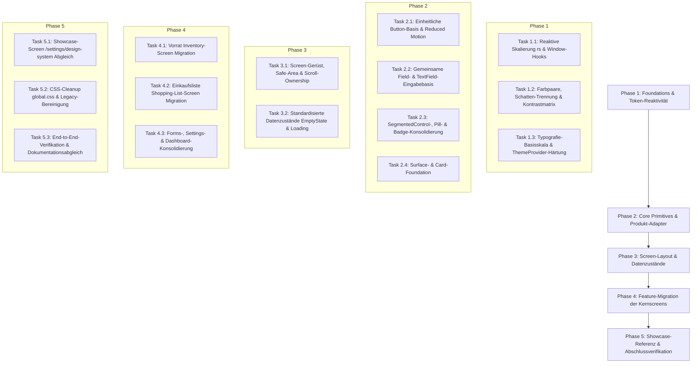

# Implementierungsplan: UI-Konsolidierung (fam-Design-System)

Status: Entwurf zur Freigabe (Plattformparität PLAT-01 out of scope)  
Stand: 2026-09-05  
Initiative: `ui-consolidation`  
Referenzdokumente:
- Spezifikation: [SPEC.md](../../docs/specs/ui-consolidation/SPEC.md)
- Normative Verträge: [docs/design-system/contracts/](../../docs/design-system/contracts/README.md) (Verträge 01 bis 10)

---

## 1. Übersicht & Ziel

fam erhält eine konsistente, zugängliche und wartbare Benutzeroberfläche auf Basis des vorhandenen Design-Systems. Ziel ist die Beseitigung historischer Abweichungen (doppelte Button-/Input-/Segment-APIs, ungeprüfte Farb- und Schattenkombinationen, semantische CSS-/NativeWind-Legacy-Klassen, statische Importzeit-Berechnungen von Maßen) bei Erhalt der warmen Mauve-/Creme-Identität und aller bestehenden Produktfunktionen.

Am Ende der Umsetzung gilt:
1. **Genau drei Verantwortliche:** Tokens in `src/components/theme/index.ts`, Themeauflösung in `src/components/theme/ThemeProvider.tsx`, Primitiv- und Darstellungsrezepte in `src/constants/ui.tsx`.
2. **Kanonische Produkt-APIs:** Konsolidierte `Button`-, `TextField`- und `SegmentedControl`-Komponenten, die dieselbe Rezeptbasis nutzen und als Einstiegspunkte für Features dienen.
3. **Barrierefreiheit & Robustheit:** Reaktivität bei Resize/Rotation (`useWindowDimensions`), 44 × 44 pt Mindesttouchbereich, WCAG-Kontraste (4,5:1 Text, 3:1 Status/Fokus), vollständiges Reduced-Motion- und Offline-Handling.
4. **Keine semantischen NativeWind-Klassen im Produktcode:** NativeWind steuert ausschließlich statisches Layout (Flex, Gap, Padding, Alignment).
5. **Scope-Eingrenzung:** `PLAT-01 Plattformparität` (Erstellung/Pflege separater `.android.tsx`-Kopien für Screens) ist ausdrücklich **out of scope**. Änderungen fokussieren sich auf die kanonischen plattformübergreifenden TypeScript/React-Native-Komponenten.

---

## 2. Architektur- und Designentscheidungen

| ID | Bereich | Verbindliche Entscheidung | Begründung & Referenz |
| --- | --- | --- | --- |
| **ARC-01** | Verantwortlichkeit | Dreiteilung strikt einhalten: `index.ts` (Werte), `ThemeProvider.tsx` (Zustand & aktive Palette), `ui.tsx` (Rezepte & Primitive). Keine vierte Styling-Schicht. | SPEC.md ARC-01, README.md |
| **ARC-02** | APIs | Produkt-APIs sind der kanonische Einstieg (`src/components/ui/buttons/`, `src/components/forms/text-field.tsx`, `src/components/ui/segmented-control.tsx`). Foundation-Komponenten adaptieren dieselbe Basis. | SPEC.md ARC-02, Vertrag 07, 08 |
| **ARC-03** | Styling-Grenzen | `className` nur für statisches Layout; semantische Zustände (`active:`, `focus:`, Farbklassen wie `bg-accent`, `input-field`) werden vollständig durch `ui.tsx`-Rezepte abgelöst. | SPEC.md ARC-03, Vertrag 05 |
| **THEME-01**| Themeauflösung | Eine aktive Theme-Wahl (`system/light/dark`), Formularzustände bleiben beim Wechsel erhalten. Keine CSS-Theme-Bridge oder `vars()`. | SPEC.md THEME-01, Vertrag 01 |
| **COLOR-01**| Farbpaare & Kontrast | Geprüfte Vordergrund-/Hintergrundpaare (mind. 4,5:1 Text, 3:1 Nicht-Text). Schattenfarben ausschließlich für Schatten, nie für Text oder Icons. | SPEC.md COLOR-01, Vertrag 01, 04 |
| **TYPE-01** | Typografie | 7 feste Basiskategorien (`display`, `title`, `heading`, `subheading`, `body`, `label`, `caption`). Reaktiviertes `rs()` begrenzt auf verfügbare Breite via `useWindowDimensions()`; System-Font-Scaling bleibt aktiv. | SPEC.md TYPE-01, Vertrag 02 |
| **SPACE-01**| Abstände & Layout | Feste Basisskala (`xs` bis `xxxl`). Reaktiv berechnete Inhaltsbreite (`CONTENT_MAX_WIDTH = 600`). Mindesttouchflächen mindestens 44 × 44 pt. | SPEC.md SPACE-01, Vertrag 03 |
| **BTN-01**  | Buttons & Motion | 4pt sichtbare Tiefe (`BUTTON_DEPTH = 4`), 4pt Druckweg in 60 ms. `flat`-Ausnahme nur für Header-Aktionen. Bei Reduced Motion entfallen Federung/Scale. | SPEC.md BTN-01, PRESS-01, Vertrag 07 |
| **FIELD-01**| Textfelder | Gemeinsame Eingabebasis für `TextField` und `Field`. Gleichzeitige Darstellung von Fokus + Fehler. Geometriestabilität ohne Layoutsprung (1,5pt Basis, 2pt Fokus). | SPEC.md FIELD-01, Vertrag 08 |
| **SELECT-01**| Auswahl & Filter | Kanonischer `SegmentedControl` mit Barrierefreiheitsrollen (`tab` vs. Formular-Auswahl), touchfähigen Segmenten, Mehrfachfilter abwählbar. | SPEC.md SELECT-01, Vertrag 08 |
| **STATE-01**| Datenzustände | Klare Trennung: Initial Loading (ruhig/Skeletons), Empty (konkret), Filter leer, Error (mit gezieltem Retry), Refresh (bestehende Daten bleiben sichtbar). | SPEC.md STATE-01, Vertrag 10 |
| ~~PLAT-01~~ | Plattformen | *OUT OF SCOPE:* Keine Verpflichtung zur Erstellung oder Synchronisation separater `.android.tsx`-Plattformdateien. | Maintainer-Vorgabe vom 2026-09-05 |

---

## 3. Phasen- und Abhängigkeitsübersicht

---

## 4. Risiken und Gegenmaßnahmen

| Risiko | Schweregrad | Gegenmaßnahme |
| --- | --- | --- |
| **Reaktives `rs()` führt zu Re-Render-Schleifen oder Performance-Einbußen** | Mittel | Skalierung über reaktiven Hook (`useWindowDimensions()`) nur bei echten Dimension-Änderungen triggern, Tokens als gecachte/memoized Werte bereitstellen. |
| **Layout-Sprünge bei Feld-Fokussierung (1,5pt vs 2pt Border)** | Niedrig | Geometrieausgleich über Padding-Reduktion um 0,5pt im fokussierten Zustand im zentralen Rezept in `ui.tsx`. |
| **Kontrastkonflikte in dunklen Badges (`shadowCard` als Text)** | Mittel | Striktes Verbot von Schattenfarben als Vordergrund. Explizite Textfarben-Tokens in `makeAccent()` und `makeCategoryTone()`. |
| **Bestehende Tests brechen wegen geänderter Props oder Klassen** | Mittel | Dünne Rückwärtskompatibilitäts-Adapter für veraltete Props (`title`, `sm/md/lg`), schrittweise Migration mit gezielten RNTL-Tests. |

---

## 5. Offene Maintainer-Entscheidungen (vor Ausführung)

1. **Visuelle Mock-Auswahl (D-04 / D-05):** Sichtbare Änderungen an Listen-Dichte (ein- vs. zweizeilige Einkaufsliste) und konkrete Hexwert-Feinjustierungen für Kontrastoptimierung bedürfen vorab statischer Mocks zur Auswahl durch Marco.
2. **iOS-Verifikation:** Auf Windows-Entwicklungsumgebungen ist die native iOS-Verifikation limitiert. Automatisierte RNTL-Tests und Android-Dev-Client dienen als Primärnachweis.
