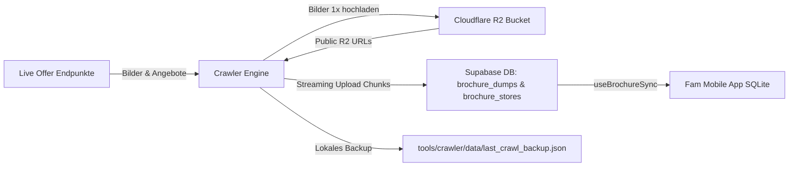

# Fam Prospekte & Supermarkt-Crawler (Batch & Streaming Engine)

Vollständig autarker, performanter Crawler zum Abruf aller aktuellen Supermarkt-, Discounter- und Drogerie-Wochenprospekte für ganz Deutschland mit automatischem **Cloudflare R2 Bild-Hosting** und **Supabase Live-Streaming**.

---

## 🏗️ Architektur & Datenfluss



1. **Quellen-Abruf:** Der Crawler fragt alle Händler (Lidl, Kaufland, Rewe, Aldi Nord/Süd, Penny, Netto, Edeka, Rossmann, dm etc.) für die jeweiligen Postleitzahlen ab.
2. **R2 Bild-Hosting:** Cover- und Seitenbilder erhalten deterministische SHA-256-Keys. Ein gemeinsamer Promise-Cache, ein Remote-`HEAD` und ein bedingtes `PUT` verhindern doppelte Uploads innerhalb und zwischen Zonen-Jobs.
3. **Live-Streaming nach Supabase:** Während des Crawlens werden fertige PLZ-Dumps sofort in 10er-Batches nach Supabase gestreamt (keine Timeouts, keine Wartezeit am Ende).
4. **App-Synchronisation:** Die mobile Fam-App synchronisiert die Daten aus Supabase in ihr lokales SQLite und lädt die Bilder direkt von der schnellen R2-Domain.

---

## ✨ Features & Schutzmechanismen

- **⚡ Echtes Live-Streaming:** Chunks werden während des Crawlens parallel in Supabase geschrieben. Bei vorzeitigem Abbruch sind alle bis dahin verarbeiteten PLZ bereits live.
- **🖼️ Cloudflare R2 Bild-Hosting:** 
  - Deterministische Hash-Keys: `brochures/dumps/{brochureId}/{context}-{hash16}.jpg`
  - `HEAD` vor dem Download und `If-None-Match: *` beim Upload
  - Extern konfigurierte Cloudflare-Lifecycle-Regel: `brochures/dumps/` nach 60 Tagen löschen
  - Der Crawler-Key benötigt nur Object Read & Write und keine Bucket-Adminrechte
  - Zero-Dependencies AWS SigV4 Signierung mit nativem `node:crypto`.
  - Cache-Control: `public, max-age=604800, immutable`.
- **🛡️ PostgreSQL Null-Byte Schutz:** Bereinigt alle Texte rekursiv von `\u0000`- und Steuerzeichen, um Postgres `22P05` Fehler zu verhindern.
- **💾 Atomares Backup (`last_crawl_backup.json`):** Zwischenstände werden parallel auf Festplatte gesichert.
- **⏱️ Live-Fortschritt & ETA:** Zeigt im Terminal Geschwindigkeit (PLZ/s), Fortschrittsbalken und verbleibende Restzeit an.
- **📦 Schneller Backup-Upload (`--from-backup`):** Erlaubt es, bereits gecrawlte Dumps in wenigen Sekunden ohne erneuten Web-Traffic nach Supabase zu übertragen.
- **🤖 GitHub Actions Etappen-Matrix:** Führt wöchentliche Updates in 5 parallelen Zonen-Jobs à ~60s ressourcenschonend aus.

---

## 🔑 Umgebungsvariablen (`.env` / `.env.development.local`)

| Variable | Beschreibung | Erforderlich |
| :--- | :--- | :--- |
| `BRING_AUTH_TOKEN` | Auth-Token für Live-Endpunkte | Ja (für Live-Daten) |
| `BRING_API_KEY` | API-Key für Live-Endpunkte | Ja (für Live-Daten) |
| `BRING_USER_UUID` | User-UUID für Live-Endpunkte | Ja (für Live-Daten) |
| `SUPABASE_URL` | URL deiner Supabase-Instanz | Ja (für DB-Upload) |
| `SUPABASE_SECRET_KEY` | Service-Role / Secret-Key für Supabase | Ja (für DB-Upload) |
| `R2_ACCOUNT_ID` | Cloudflare Account ID | Optional (für R2-Hosting) |
| `R2_ACCESS_KEY_ID` | R2 S3 Access Key ID | Optional (für R2-Hosting) |
| `R2_SECRET_ACCESS_KEY` | R2 S3 Secret Access Key | Optional (für R2-Hosting) |
| `R2_BUCKET` | Name des R2 Buckets (z. B. `fam-brochures`) | Optional (für R2-Hosting) |
| `R2_PUBLIC_URL` | Public Domain (z. B. `https://pub-xxx.r2.dev`) | Optional (für R2-Hosting) |

---

## 🚀 CLI-Befehle & Anwendungsbeispiele

Alle Befehle werden über `bun run crawler:brochures` gestartet:

### 1. Einzelne Postleitzahlen crawlen
```bash
# Einzelne PLZ:
bun run crawler:brochures --plz=22043

# Mehrere PLZs:
bun run crawler:brochures --plz=22043,20095,10115
```

### 2. Nach Postleitzahlen-Zonen filtern
```bash
# Norddeutschland (Zonen 2 & 3):
bun run crawler:brochures --zone=2,3

# NRW & Ruhrgebiet (Zonen 4 & 5):
bun run crawler:brochures --zone=4,5

# Süddeutschland / Bayern (Zonen 8 & 9):
bun run crawler:brochures --zone=8,9
```

### 3. Prozent-Stichproben & Tranchen (z. B. 20% bundesweit)
```bash
# Erste 20% gleichmäßig über Deutschland verteilt:
bun run crawler:brochures --sample=20%

# Nächste 20% (zweite Tranche, ohne Überschneidung):
bun run crawler:brochures --sample=20% --offset=1

# Dritte Tranche:
bun run crawler:brochures --sample=20% --offset=2
```

### 4. Ganz Deutschland (100% aller ~8.200 PLZ)
```bash
bun run crawler:brochures --all
```

### 5. Schneller Upload aus lokalem Backup (ohne Web-Traffic)
```bash
bun run crawler:brochures --from-backup
```

### 6. Dry-Run (Nur Testen ohne Upload nach Supabase/R2)
```bash
bun run crawler:brochures --sample=10% --dry-run
```

---

## 🧪 Tests ausführen

Die Test-Suite prüft Null-Byte-Filterung, Hash-Key-Generierung, R2-Signierung, Uploader-Resilienz und Caching:

```bash
bun test tools/crawler/brochures/
```
