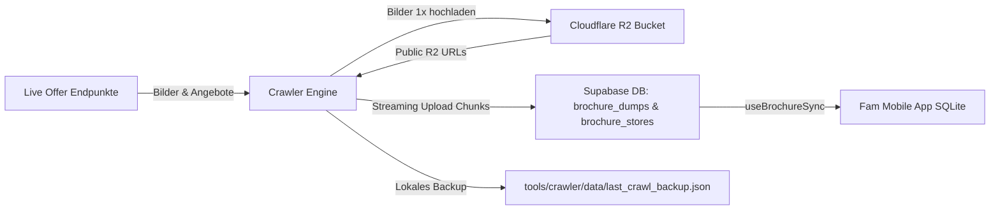

# Fam Prospekte & Supermarkt-Crawler (Batch & Streaming Engine)

Vollständig autarker, performanter Crawler zum Abruf aller aktuellen Supermarkt-, Discounter- und Drogerie-Wochenprospekte für ganz Deutschland mit automatischem **Cloudflare R2 Bild-Hosting** und **Supabase Live-Streaming**.

---

## 🏗️ Architektur & Datenfluss



1. **Quellen-Abruf:** Der Crawler fragt alle Händler (Lidl, Kaufland, Rewe, Aldi Nord/Süd, Penny, Netto, Edeka, Rossmann, dm etc.) für die jeweiligen Postleitzahlen ab.
2. **R2 Bild-Hosting:** Cover- und Seitenbilder erhalten deterministische SHA-256-Keys. Ein gemeinsamer Promise-Cache, ein Remote-`HEAD` und ein bedingtes `PUT` verhindern doppelte Uploads innerhalb und zwischen Zonen-Jobs.
3. **Live-Streaming nach Supabase:** Während des Crawlens werden fertige PLZ-Dumps sofort in 10er-Batches nach Supabase gestreamt (keine Timeouts, keine Wartezeit am Ende).
4. **App-Synchronisation:** Die mobile Fam-App synchronisiert die Daten aus Supabase in ihr lokales SQLite und lädt die Bilder direkt von der schnellen R2-Domain.

---

## ✨ Features & Schutzmechanismen

- **⚡ Echtes Live-Streaming:** Chunks werden während des Crawlens parallel in Supabase geschrieben. Bei vorzeitigem Abbruch sind alle bis dahin verarbeiteten PLZ bereits live.
- **🖼️ Cloudflare R2 Bild-Hosting:** 
  - Globale URL-Hash-Keys: `brochures/dumps/assets/{sha256}.jpg` (unabhängig von Prospekt-ID und Kontext)
  - Bilder werden vor dem Upload auf maximal 2048px Breite und JPEG-Qualität 82 optimiert
  - `HEAD` vor dem Download und `If-None-Match: *` beim Upload
  - Extern konfigurierte Cloudflare-Lifecycle-Regel: `brochures/dumps/` nach 60 Tagen löschen
  - Der Crawler-Key benötigt nur Object Read & Write und keine Bucket-Adminrechte
  - Zero-Dependencies AWS SigV4 Signierung mit nativem `node:crypto`.
  - Cache-Control: `public, max-age=604800, immutable`.
- **🛡️ PostgreSQL Null-Byte Schutz:** Bereinigt alle Texte rekursiv von `\u0000`- und Steuerzeichen, um Postgres `22P05` Fehler zu verhindern.
- **💾 Atomares Backup (`last_crawl_backup.json`):** Zwischenstände werden parallel auf Festplatte gesichert.
- **⏱️ Live-Fortschritt & ETA:** Zeigt im Terminal Geschwindigkeit (PLZ/s), Fortschrittsbalken und verbleibende Restzeit an.
- **📦 Schneller Backup-Upload (`--from-backup`):** Erlaubt es, bereits gecrawlte Dumps in wenigen Sekunden ohne erneuten Web-Traffic nach Supabase zu übertragen.
- **🤖 GitHub Actions Etappen-Matrix:** Führt wöchentliche Updates in 5 parallelen Zonen-Jobs à ~60s ressourcenschonend aus.

---

## 🔑 Umgebungsvariablen (`.env` / `.env.development.local`)

| Variable | Beschreibung | Erforderlich |
| :--- | :--- | :--- |
| `BRING_AUTH_TOKEN` | Auth-Token für Live-Endpunkte | Ja (für Live-Daten) |
| `BRING_API_KEY` | API-Key für Live-Endpunkte | Ja (für Live-Daten) |
| `BRING_USER_UUID` | User-UUID für Live-Endpunkte | Ja (für Live-Daten) |
| `SUPABASE_URL` | URL deiner Supabase-Instanz | Ja (für DB-Upload) |
| `SUPABASE_SECRET_KEY` | Service-Role / Secret-Key für Supabase | Ja (für DB-Upload) |
| `R2_ACCOUNT_ID` | Cloudflare Account ID | Optional (für R2-Hosting) |
| `R2_ACCESS_KEY_ID` | R2 S3 Access Key ID | Optional (für R2-Hosting) |
| `R2_SECRET_ACCESS_KEY` | R2 S3 Secret Access Key | Optional (für R2-Hosting) |
| `R2_BUCKET` | Name des R2 Buckets (z. B. `fam-brochures`) | Optional (für R2-Hosting) |
| `R2_PUBLIC_URL` | Public Domain (z. B. `https://pub-xxx.r2.dev`) | Optional (für R2-Hosting) |
| `OPENROUTER_API_KEY` | Optionaler OpenRouter-Key für die Prospekt-Anreicherung | Optional (nur mit `--ai`) |
| `OPENROUTER_MODEL` | OpenRouter-Modell, standardmäßig `z-ai/glm-5.3-flash` | Optional (nur mit `--ai`) |
| `OPENROUTER_REASONING_EFFORT` | Reasoning-Stufe, standardmäßig `low` | Optional (nur mit `--ai`) |
| `OPENROUTER_SITE_URL` | Optionale URL für OpenRouter-Attribution | Optional |
| `OPENROUTER_SITE_NAME` | Optionaler Name für OpenRouter-Attribution | Optional |

---

## 🚀 CLI-Befehle & Anwendungsbeispiele

Alle Befehle werden über `bun run crawler:brochures` gestartet:

### 1. Einzelne Postleitzahlen crawlen
```bash
# Einzelne PLZ:
bun run crawler:brochures --plz=22043

# Mehrere PLZs:
bun run crawler:brochures --plz=22043,20095,10115
```

### 2. Nach Postleitzahlen-Zonen filtern
```bash
# Norddeutschland (Zonen 2 & 3):
bun run crawler:brochures --zone=2,3

# NRW & Ruhrgebiet (Zonen 4 & 5):
bun run crawler:brochures --zone=4,5

# Süddeutschland / Bayern (Zonen 8 & 9):
bun run crawler:brochures --zone=8,9
```

### 3. Prozent-Stichproben & Tranchen (z. B. 20% bundesweit)
```bash
# Erste 20% gleichmäßig über Deutschland verteilt:
bun run crawler:brochures --sample=20%

# Nächste 20% (zweite Tranche, ohne Überschneidung):
bun run crawler:brochures --sample=20% --offset=1

# Dritte Tranche:
bun run crawler:brochures --sample=20% --offset=2
```

### 4. Ganz Deutschland (100% aller ~8.200 PLZ)
```bash
bun run crawler:brochures --all
```

### 5. Schneller Upload aus lokalem Backup (ohne Web-Traffic)
```bash
bun run crawler:brochures --from-backup
```

### 6. Dry-Run (Nur Testen ohne Upload nach Supabase/R2)
```bash
bun run crawler:brochures --sample=10% --dry-run
```

### 7. Lokale Bildablage auf einer externen Festplatte
```bash
# Crawl durchführen, optimierte Bilder nur lokal speichern:
bun run crawler:brochures --zone=2 --concurrency=4 --local-dir="/Volumes/<EXTERNE-FESTPLATTE>/FamCrawler/brochures" --dry-run
```

Mit `--local-dir` werden die Bilder als `brochures/dumps/assets/{sha256}.jpg`
auf dem angegebenen Laufwerk gespeichert. Zusammen mit `--dry-run` werden weder
R2 noch Supabase beschrieben. Für einen lokalen HTTP-Server kann zusätzlich
`--local-public-url=http://<deine-ip>:8765` verwendet werden; der Server muss
dann aus dem angegebenen Verzeichnis gestartet werden.

### 8. Prospekt-Versionen analysieren

Die Analyse liest das große Backup per Stream, hasht die lokal gespeicherten
Bilder und fasst byte-identische Seitenfolgen zu einer Version zusammen. Ohne
`--ai` werden keine Bilder an einen externen Dienst übertragen:

```bash
bun run analyze:brochure-versions \
  --input-dir="/Volumes/Programme/FamCrawler/brochures"
```

Mit `--ai` wird zusätzlich für jede erkannte Versionsgruppe ein Kontaktbogen
an das konfigurierte OpenRouter-Vision-Modell geschickt. Dieser Schritt annotiert die
Bilder, führt aber keine automatische KI-Zusammenführung ähnlicher Bilder
durch. Die Anzahl der Versionsgruppen ist vom jeweiligen Backup und lokalen
Bildbestand abhängig und wird nicht vorausgesetzt. Das Ergebnis liegt unter
`tools/crawler/data/brochure-version-analysis.json` und enthält Händler, Titel,
erkannte Gültigkeitsdaten und die Zuordnung der Prospekt-IDs:

```bash
dotenv -o -e .env.development.local -- \
  bun run analyze:brochure-versions \
  --input-dir="/Volumes/Programme/FamCrawler/brochures" \
  --ai
```

Die Analyse verwendet SHA-256 für byte-identische Bilddaten. Visuell ähnliche,
aber technisch unterschiedliche Bilder werden damit nicht automatisch als
identisch bewertet. Der KI-Aufruf ist optional und überträgt Bilder an den
konfigurierten externen Dienst.

### 9. Aldi V2: Erste zwei Seiten in den 16 Landeshauptstädten

V2 fragt Berlin, Bremen, Dresden, Düsseldorf, Erfurt, Hamburg, Hannover, Kiel,
Magdeburg, Mainz, München, Potsdam, Saarbrücken, Schwerin, Stuttgart und
Wiesbaden über die Live-Quelle ab. Es werden nur Aldi-Prospekte und daraus nur
die ersten zwei Seiten heruntergeladen. Die Bilddateien werden nach dem
optimierten Dateiinhalt adressiert und deshalb bei identischen Seiten nur
einmal gespeichert. Das Manifest enthält trotzdem alle Städte und
Prospektverweise.

```bash
dotenv -o -e .env.development.local -- \
  bun run crawler:aldi-v2 \
  --output-dir="/Volumes/Programme/FamCrawler/aldi-v2" \
  --concurrency=4
```

Für einen einzelnen Test:

```bash
dotenv -o -e .env.development.local -- \
  bun run crawler:aldi-v2 \
  --output-dir="/Volumes/Programme/FamCrawler/aldi-v2-test" \
  --capitals="Berlin" \
  --concurrency=1
```

Die Pipeline schreibt `manifest.json` nach jedem verarbeiteten Standort und
legt die Bilder unter `assets/{sha256}.jpg` ab. Sie schreibt weder nach R2 noch
nach Supabase.

### 10. Händler: Geografischer Stichprobentest

Für den Vergleich regionaler Händlerausgaben kann eine Stichprobe über ganz
Deutschland geladen werden. Der Crawler nimmt mindestens eine PLZ je
zweistelligem PLZ-Gebiet und ergänzt bis zur gewünschten Stichprobengröße.
Standardmäßig werden Lidl, Kaufland, Netto Marken-Discount und REWE verglichen.
Pro Prospekt werden drei bis sechs oder mit `--pages=all` alle Seiten mit echten
Produkt-Discount-Hotspots geladen; Werbeseiten ohne Produktangebote werden übersprungen. Gleichzeitig
verfügbare Prospekte mit verschiedenen Gültigkeitszeiträumen werden als
unterschiedliche Ausgaben behandelt.

```bash
dotenv -o -e .env.development.local -- \
  bun run crawler:retailer-sample \
  --output-dir="/Volumes/Programme/FamCrawler/retailer-sample" \
  --stores=lidl,kaufland,netto,rewe \
  --sample-size=100 \
  --pages=6 \
  --concurrency=8
```

Die Bilddateien werden über den optimierten Dateiinhalt dedupliziert. Das
Manifest unter `manifest.json` zeigt, welche PLZ denselben Prospekt geliefert
haben, wie viele Versionen je Händler existieren und wie viele einzigartige
Bilddateien tatsächlich gespeichert wurden. Der bisherige Aldi-Test bleibt
über `crawler:aldi-sample-v2` verfügbar und fügt fünf offiziell bestätigte
ALDI-Nord-Kontroll-PLZ ein.

Für eine vollständige Verifikation werden alle Seiten mit Produktangeboten
geladen und zusätzlich mit einem perceptual dHash versehen:

```bash
dotenv -o -e .env.development.local -- \
  bun run crawler:retailer-sample \
  --output-dir="/Volumes/Programme/FamCrawler/retailer-full" \
  --stores=lidl,kaufland,netto,rewe \
  --sample-size=100 \
  --pages=all \
  --concurrency=8

bun run crawler:verify \
  --manifest="/Volumes/Programme/FamCrawler/retailer-full/manifest.json"

bun run crawler:review \
  --report="/Volumes/Programme/FamCrawler/retailer-full/verification-report.json"
```

Der Verifikationsbericht vergleicht nur Prospekte desselben Händlers mit
demselben Gültigkeitszeitraum. Byte-identische Sequenzen werden automatisch
bestätigt, klar verschiedene Sequenzen verworfen und visuell ähnliche
Grenzfälle in `verification-report.json` aufgenommen. Der lokale Review-Server
speichert Entscheidungen dauerhaft in `review-decisions.json`.

Für eine vollständig automatische, konservative Prüfung kann lokales OCR
zugeschaltet werden:

```bash
bun run crawler:verify \
  --manifest="/Volumes/Programme/FamCrawler/retailer-full/manifest.json" \
  --ocr \
  --ocr-concurrency=4
```

Die automatische Klassifikation schreibt `identical`, `regional-variant`,
`different` oder `uncertain` pro Kandidat. Nur `identical` darf für eine
unbeaufsichtigte Speicherdeduplizierung zusammengeführt werden. Details zur
Kalibrierung, zum 1.000-PLZ-Lauf und zu den bekannten Grenzen stehen in
[`docs/BROCHURE_DEDUPLICATION_ANALYSIS.md`](../../../docs/BROCHURE_DEDUPLICATION_ANALYSIS.md).

---

## 🧪 Tests ausführen

Die Test-Suite prüft Null-Byte-Filterung, Hash-Key-Generierung, R2-Signierung, Uploader-Resilienz und Caching:

```bash
bun run test tools/crawler/brochures/ --runInBand --watchman=false
```
