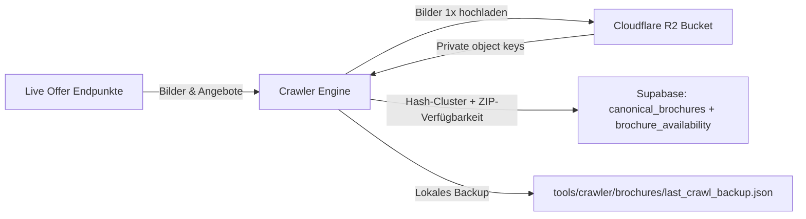

# Fam Prospekte & Supermarkt-Crawler

Crawler zum Abruf aktueller Wochenprospekte mit privaten **Cloudflare-R2-Bildern** und einem nach Abschluss des Crawls atomar veröffentlichten, verifizierten Katalog.

---

## 🏗️ Architektur & Datenfluss


```mermaid
graph LR
    A[Live Offer Endpunkte] -->|Bilder & Angebote| B[Crawler Engine]
    B -->|Bilder 1x hochladen| C[Cloudflare R2 Bucket]
    C -->|Private object keys| B
    B -->|Hash-Cluster + ZIP-Verfügbarkeit| D[Supabase: canonical_brochures + brochure_availability]
    B -->|Lokales Backup| E[tools/crawler/brochures/last_crawl_backup.json]
```

1. **Quellen-Abruf:** Der Produktions-Crawler fragt Bring-Angebote für die jeweiligen Postleitzahlen ab und lädt Detailseiten sowie Bilder.
2. **Kandidatenfilter:** Händler, Gültigkeit und Seitenzahl bestimmen die Metadatengruppe. Ein Seite-1-Hash teilt Kandidaten weiter auf, beweist aber keine vollständige Prospektgleichheit.
3. **Inhaltsidentität:** Nur gleiche, geordnete SHA-256-Vektoren aller Seiten innerhalb derselben Metadatengruppe dürfen zusammengeführt werden. Regionale Varianten mit abweichenden Seitenbytes bleiben getrennte Datensätze.
4. **R2 Bild-Hosting und Veröffentlichung:** Optimierte Bildbytes erhalten deterministische SHA-256-Keys. Erst nach vollständig abgeschlossenem Crawl ersetzt eine Datenbanktransaktion die Verfügbarkeiten der vollständig geprüften PLZ; Teil-Läufe erhalten Einträge außerhalb ihres ZIP-Scopes.

**Aktuelle Veröffentlichungssperre:** Cloudflare-/R2-Uploads, Deploys,
Cutovers und andere Remote-Schreibvorgänge sind erst freigegeben, nachdem Marco
die lokal erzeugten Prospekte visuell geprüft und ausdrücklich freigegeben hat.
Die Sperre gilt auch für manuell gestartete und geplante GitHub Actions. Bis
dahin ausschließlich lokale Listing-only-Ausgaben verwenden.

---

## ✨ Features & Schutzmechanismen

- **🖼️ Cloudflare R2 Bild-Hosting:**
  - Globale, aus der Quell-URL abgeleitete SHA-256-Keys: `brochures/dumps/assets/{sha256}.jpg` (unabhängig von Prospekt-ID und Kontext)
  - Bilder werden vor dem Upload auf maximal 2048px Breite und JPEG-Qualität 82 optimiert
  - `HEAD` vor dem Download und `If-None-Match: *` beim Upload
  - Dieser Crawler richtet keine Lifecycle-Regel ein und löscht im ersten Retention-Schritt keine Objekte.
  - Der Crawler-Key benötigt nur Object Read & Write und keine Bucket-Adminrechte
  - Zero-Dependencies AWS SigV4 Signierung mit nativem `node:crypto`.
  - Cache-Control: `public, max-age=604800, immutable`.
- **🛡️ PostgreSQL Null-Byte Schutz:** Bereinigt alle Texte rekursiv von `\u0000`- und Steuerzeichen, um Postgres `22P05` Fehler zu verhindern.
- **💾 Atomares Backup (`last_crawl_backup.json`):** Zwischenstände werden parallel auf Festplatte gesichert und mit einer Lauf-ID an die Diagnosen gebunden.
- **⏱️ Live-Fortschritt & ETA:** Zeigt im Terminal Geschwindigkeit (PLZ/s), Fortschrittsbalken und verbleibende Restzeit an.
- **📦 Backup-Veröffentlichung (`--from-backup`):** Veröffentlicht ein lokales Backup ohne Bring-Aufrufe. Es werden nur PLZ mit vollständiger, zum Lauf passender Diagnose veröffentlicht; das Backup muss SHA-256-Bildidentitäten des aktuellen Formats enthalten.
- **🤖 GitHub Actions Etappen-Matrix:** Führt wöchentliche Updates in 5 parallelen Zonen-Jobs à ~60s ressourcenschonend aus.

---

## 🔑 Umgebungsvariablen (`.env` / `.env.development.local`)

| Variable | Beschreibung | Erforderlich |
| :--- | :--- | :--- |
| `BRING_AUTH_TOKEN` | Auth-Token für Live-Endpunkte | Ja (für Live-Daten) |
| `BRING_API_KEY` | API-Key für Live-Endpunkte | Ja (für Live-Daten) |
| `BRING_USER_UUID` | User-UUID für Live-Endpunkte | Ja (für Live-Daten) |
| `SUPABASE_URL` | URL deiner Supabase-Instanz | Ja (für DB-Upload) |
| `SUPABASE_SECRET_KEY` | Service-Role / Secret-Key für Supabase | Ja (für DB-Upload) |
| `R2_ACCOUNT_ID` | Cloudflare Account ID | Ja (für Veröffentlichung) |
| `R2_ACCESS_KEY_ID` | R2 S3 Access Key ID | Ja (für Veröffentlichung) |
| `R2_SECRET_ACCESS_KEY` | R2 S3 Secret Access Key | Ja (für Veröffentlichung) |
| `R2_BUCKET` | Name des R2 Buckets (z. B. `fam-brochures`) | Ja (für Veröffentlichung) |
| `OPENROUTER_API_KEY` | Optionaler OpenRouter-Key für die Prospekt-Anreicherung | Optional (nur mit `--ai`) |
| `OPENROUTER_MODEL` | OpenRouter-Modell, standardmäßig `z-ai/glm-5.3-flash` | Optional (nur mit `--ai`) |
| `OPENROUTER_REASONING_EFFORT` | Reasoning-Stufe, standardmäßig `low` | Optional (nur mit `--ai`) |
| `OPENROUTER_SITE_URL` | Optionale URL für OpenRouter-Attribution | Optional |
| `OPENROUTER_SITE_NAME` | Optionaler Name für OpenRouter-Attribution | Optional |


| `OPENROUTER_API_KEY` | Authentifizierung für Bildanalyse. | Pflicht nur bei `--ai`. |
| `OPENROUTER_MODEL` | Zu verwendendes OpenRouter-Modell. | `z-ai/glm-5.3-flash` |
| `OPENROUTER_BASE_URL` | OpenRouter-kompatibler API-Endpunkt. | `https://openrouter.ai/api/v1` |
| `OPENROUTER_REASONING_EFFORT` | Reasoning-Stufe der Anfrage. | `low` |
| `OPENROUTER_SITE_URL` | Optionale OpenRouter-Attribution als HTTP-Referer. | Nicht gesetzt |
| `OPENROUTER_SITE_NAME` | Optionaler Name für OpenRouter-Attribution. | Nicht gesetzt |
| `BROCHURE_AI_MAX_CALLS` | Maximale Anzahl KI-Anfragen; überschreibbar mit `--ai-max-calls`. | `20` |
| `BROCHURE_AI_MAX_TOKENS` | Maximale Antwortlänge je Anfrage; überschreibbar mit `--ai-max-tokens`. | `300` |
| `BROCHURE_AI_TIMEOUT_MS` | Anfrage-Timeout in Millisekunden. | `45000` |

Ohne `--ai` werden keine Bilder an OpenRouter gesendet. Die KI-Variablen sind
nicht nötig, um den normalen Crawler oder die lokale SHA-Analyse auszuführen.

---

## 🚀 CLI-Befehle & Anwendungsbeispiele

Der Haupt-Crawler wird über `bun run crawler:brochures` gestartet. Die Beispiele
laden `.env.development.local` explizit mit Bun. Wenn deine Zugangsdaten anders
geladen werden, kannst du `--env-file` weglassen.

### 1. Einzelne Postleitzahlen crawlen

Dieser Befehl fragt Bring live für alle aktiven Prospektquellen und die drei
PLZ ab und legt ein lokales JSON-Backup samt Laufdiagnose an. Er lädt Bilder in
den privaten R2-Bucket und veröffentlicht danach den kanonischen Katalog samt
PLZ-Verfügbarkeit atomar in Supabase. Unvollständige PLZ-Läufe werden nicht
veröffentlicht. Ohne R2-Konfiguration bricht ein regulärer Lauf ab, damit keine
externen Bild-URLs in den Katalog gelangen. `--local-dir` ist nur zusammen mit
`--dry-run` verfügbar.

```bash
# Einzelne PLZ:
bun --env-file=.env.development.local run crawler:brochures --plz=22043

# Mehrere PLZs:
bun --env-file=.env.development.local run crawler:brochures --plz=22043,20095,10115
```

Ein regulärer Lauf braucht Bring-Zugangsdaten, Supabase-URL und Secret-Key
sowie R2-Zugangsdaten. Für R2-Uploads müssen `R2_ACCOUNT_ID`,
`R2_ACCESS_KEY_ID`, `R2_SECRET_ACCESS_KEY` und `R2_BUCKET` gesetzt sein.

### 2. Nach Postleitzahlen-Zonen filtern
```bash
# Norddeutschland (Zonen 2 & 3):
bun --env-file=.env.development.local run crawler:brochures --zone=2,3

# NRW & Ruhrgebiet (Zonen 4 & 5):
bun --env-file=.env.development.local run crawler:brochures --zone=4,5

# Süddeutschland / Bayern (Zonen 8 & 9):
bun --env-file=.env.development.local run crawler:brochures --zone=8,9
```

### 3. Prozent-Stichproben & Tranchen (z. B. 20% bundesweit)
```bash
# Erste 20% gleichmäßig über Deutschland verteilt:
bun --env-file=.env.development.local run crawler:brochures --sample=20%

# Nächste 20% (zweite Tranche, ohne Überschneidung):
bun --env-file=.env.development.local run crawler:brochures --sample=20% --offset=1

# Dritte Tranche:
bun --env-file=.env.development.local run crawler:brochures --sample=20% --offset=2
```

### 4. Ganz Deutschland (100% aller ~8.200 PLZ)
```bash
bun --env-file=.env.development.local run crawler:brochures --all
```

### 5. Schneller Upload aus lokalem Backup (ohne Web-Traffic)
```bash
bun --env-file=.env.development.local run crawler:brochures --from-backup
```

### 6. Dry-Run (live abfragen, ohne Upload nach Supabase/R2)

`--dry-run` schaltet R2- und Supabase-Schreibzugriffe aus. Die Bring-Abfragen
finden trotzdem live statt. `--sample=10%` fragt 10 Prozent der verfügbaren PLZ
ab. Der Haupt-Crawler schreibt das Daten-Backup und die Laufdiagnose unter
`tools/crawler/brochures/last_crawl_backup.json`; ohne `--local-dir` lädt er
keine Bilddateien herunter und legt daher auch keine Bilder lokal ab. Mit
`--local-dir` lädt er optimierte Bilder lokal herunter und speichert sie dort,
weiterhin ohne R2- oder Supabase-Upload. Für den Dry-Run sind Bring-Zugangsdaten
erforderlich, Supabase- und R2-Zugangsdaten nicht.

```bash
bun --env-file=.env.development.local run crawler:brochures --sample=10% --dry-run

# Dry-Run mit lokal gespeicherten Bildern:
bun --env-file=.env.development.local run crawler:brochures \
  --sample=10% \
  --dry-run \
  --local-dir="tools/crawler/data/brochure-images"
```

### 7. Lokale Bildablage
```bash
# Live-Crawl durchführen, optimierte Bilder nur lokal speichern:
bun --env-file=.env.development.local run crawler:brochures \
  --zone=2 \
  --concurrency=4 \
  --local-dir="tools/crawler/data/brochure-images" \
  --dry-run
```

Mit `--local-dir` werden die Bilder als
`brochures/dumps/assets/{sha256-der-quell-url}.jpg` auf dem angegebenen
Laufwerk gespeichert. Zusammen mit `--dry-run` werden weder
R2 noch Supabase beschrieben. Für einen lokalen HTTP-Server kann zusätzlich
`--local-public-url=http://<deine-ip>:8765` verwendet werden; der Server muss
dann aus dem angegebenen Verzeichnis gestartet werden.

### 8. Listing-first Vollscan und lokale Vollseitenverifikation

Der aktuelle Analysepfad beginnt mit einem bundesweiten Offers-Scan und
verarbeitet danach Detail-Seitenzahlen sowie alle Seitenhashes. Die Schritte
und Ausgabedateien sind unter
[Listing-only: Vollscan und vollständige Prospektverifikation](#listing-only-vollscan-und-vollständige-prospektverifikation)
beschrieben. Nur vollständige, geordnete Hashvektoren bestimmen die
Prospektvarianten.

---

## 🧪 Tests ausführen

Fokussierte Tests prüfen Katalogbildung, regionale Varianten, Bild-Hashes und die transaktionale Veröffentlichungsgrenze:

```bash
bun run test test/crawler/canonical-catalog.test.ts test/crawler/canonical-engine.test.ts test/crawler/canonical-image-hash.test.ts test/crawler/canonical-uploader.test.ts
```

## 💾 Speicherbudget, Aufbewahrung und lokale Berichte

Der Haupt-Crawler akzeptiert für Bildläufe diese Optionen:

| Option | Bedeutung |
| :--- | :--- |
| `--storage-budget-gb=<dezimal>` | Gemeinsames Speicherlimit in dezimalen GB (`1 GB = 1.000.000.000 Bytes`). Bestehende Dateien und reservierte neue Schreibvorgänge zählen gemeinsam. |
| `--retention-grace-days=<ganzzahl>` | Aufbewahrungsnachfrist nach `validUntil`. Ungültige oder fehlende Datumswerte werden nicht als Löschgrund verwendet. |
| `--report-dir=<verzeichnis>` | Ziel für Speicher-, Aufbewahrungs-, Vollständigkeits- und Verifikationsberichte. |

Die Optionen greifen unterschiedlich:

- `--storage-budget-gb` begrenzt neue Bilddateien im gewählten Ziel: R2 beim
  Haupt-Crawler mit R2-Konfiguration oder lokaler Ordner mit `--local-dir`.
  Ohne ein solches Bildziel gibt es keine Bildspeicher-Schreibvorgänge, die
  dieses Budget begrenzen kann.
- `--retention-grace-days` beeinflusst nur den Retention-Bericht. Der Crawler
  löscht keine Bilder und rechnet mögliche Freigaben nicht gegen das Budget.
- `--report-dir` schreibt beim Haupt-Crawler `storage-report.json`,
  `retention-report.json` und `completeness-report.json`. Diese Berichte
  werden nur angelegt, wenn `--report-dir` gesetzt ist.

### GitHub Actions: R2-Gesamtbestand auf 7 GB begrenzen

Der Workflow übergibt jedem Zonenlauf `--storage-budget-gb=7`. Das sind
7.000.000.000 Byte. Vor dem Lauf liest der Crawler den gesamten R2-Bestand des
konfigurierten Buckets ein. Beim Hochladen neuer, eindeutiger Bilder prüft das
Budget vorhandene Bytes plus laufende Reservierungen plus die Größe des neuen
Bildes. Würde der nächste Upload die Grenze überschreiten, wird dieser Upload
abgelehnt und der Lauf schlägt fehl; der Crawler löscht keine vorhandenen Bilder.

Die fünf Zonen laufen mit `max-parallel: 1`. Die Workflow-Concurrency sperrt
jetzt außerdem den ganzen Workflow über alle Branches hinweg, damit zwei
GitHub-Läufe dieses Crawlers nicht gleichzeitig mit veralteten R2-Beständen
rechnen. Damit bleibt der Schutz wirksam, solange dieser Workflow der einzige
Schreiber in den Bucket ist und der Bestand vor dem Start nicht bereits über
7 GB liegt. Andere Workflows oder lokale Crawler-Läufe mit denselben R2-
Zugangsdaten verwenden diesen Workflow-Lock nicht.

Nach jedem Zonenlauf archiviert GitHub Actions `storage-report.json` als
Workflow-Artefakt für 30 Tage. Darin zeigt `budget.requiredBytes` den
Bestand samt Reservierungen und `budget.remainingBudgetBytes` den verbleibenden
Abstand zur Grenze. Bei einem Budgetfehler zusätzlich den Crawler-Log der
Etappe prüfen. Die Berichte überwachen die Grenze; sie löschen oder bereinigen
keine R2-Objekte.

Das Budget gilt innerhalb eines Prozesses für parallele Schreibvorgänge. Ohne
zusätzliche Koordination schützt es nicht vor einem zweiten Prozess, der
gleichzeitig in dasselbe Ziel schreibt. Für reproduzierbare Läufe deshalb
einen einzelnen Writer verwenden. Der Crawler löscht in diesem Schritt keine
Dateien. Auch ein Bericht über potenziell freigebbare Bytes gibt noch keinen
Budgetplatz frei. Die Retention-Referenzbasis bleibt in diesem ersten Schritt
immer unvollständig. Ein einzelner Lauf darf keine Bereinigungsfreigabe
erzeugen.

Backup und Diagnosebestand werden als getrennte Artefakte mit derselben
`runId` gespeichert. `--from-backup` verweigert alte Array-Backups, fehlende
Diagnosen, abweichende Lauf-IDs und unvollständige Standortberichte. Es werden
nur Standorte mit `status: complete` wiederhochgeladen. Bei einem angegebenen
`--report-dir` erwartet `--from-backup` die zugehörige
`crawl-diagnostics.json`; ohne `--report-dir` liegt sie als
`last_crawl_backup.json.diagnostics.json` neben dem Backup.

Die vollständigen GeoNames-Stammdaten werden aktuell aus
`tools/crawler/brochures/geonames-DE.txt` oder über `BROCHURE_LOCATIONS_FILE`
geladen. `--all` bricht ab, wenn keine vollständige Datei mit mehr als 1.000
PLZ gefunden wird; ein Fallback auf die zwölf Standardorte ist dann nicht
zulässig. Das Backup liegt standardmäßig unter
`tools/crawler/brochures/last_crawl_backup.json`.

## Listing-only: Vollscan und vollständige Prospektverifikation

Der Listing-only-Lauf baut lokal einen bundesweiten Prospektbestand auf. Er
beginnt mit Angeboten je PLZ und ergänzt echte Detail-Seitenzahlen je BRN. Der
Vollseiten-Verifizierer lädt danach die Originalbytes aller Seiten. Es gibt
keine R2- oder Supabase-Schreibzugriffe.

Bring-Zugangsdaten müssen in `.env.development.local` gesetzt sein. Alle
Befehle sind vom Repository-Stamm auszuführen:

```bash
bun --env-file=.env.development.local run \
  tools/crawler/brochures/listing-only/all-stores-full.ts

bun --env-file=.env.development.local run \
  tools/crawler/brochures/listing-only/fetch-detail-pages.ts

bun run tools/crawler/brochures/listing-only/group-canonical.ts

bun run tools/crawler/brochures/listing-only/metadata-candidates.ts

bun --env-file=.env.development.local run \
  tools/crawler/brochures/listing-only/verify-full-brochures.ts \
  --candidate-report=tools/crawler/data/listing-only/metadata-candidate-report.json \
  --budget-bytes=10737418240

bun --env-file=.env.development.local run \
  tools/crawler/brochures/listing-only/verify-full-brochures.ts \
  --zip-code=22043 \
  --budget-bytes=10737418240

bun run tools/crawler/brochures/listing-only/persist-canonical.ts
bun run tools/crawler/brochures/listing-only/canonical-report.ts
```

Der Vollscan ist fortsetzbar und schreibt `all-stores-full.json`. Der Detail-
Abruf ermittelt echte Seitenzahlen einmal je BRN. Die Gruppierung verwendet
`storeName + validFrom + validUntil + detailPageCount`; Titel und URL sind keine
zusätzlichen Gruppenschlüssel. Der aktuelle Vollscan vom 2026-10-07 enthält
10.813 PLZ, 217.178 Prospekt-Sichtungen, 4.550 BRNs und 119 Metadaten-Gruppen.

Die Standardausgaben liegen unter `tools/crawler/data/listing-only/`:
`all-stores-full.json`, `detail-pages.json`, `canonical-groups.json`,
`metadata-candidate-index.json`, `metadata-candidate-report.json`,
`canonical-page-verification.json`,
`.canonical-page-verification-progress.json`,
`canonical-page-verification-pilot.json`,
`.canonical-page-verification-pilot-progress.json`,
`canonical-page-verification-22043.json`, `review-sample-22043/`,
`page-assets/<sha256>.bin`, `canonical-brochures.json` und
`canonical-report.json`; Pilot-Assets liegen getrennt in `page-assets-pilot/`.
Der 123-BRN-Händlerpilot bleibt unvollständig. Für PLZ 22043 wurde ein
vollständiger Sample-Lauf mit 25 BRNs, 22 Metadatengruppen und 590 Seiten
abgeschlossen.

`metadata-candidates.ts` vergleicht aktuelle Metadaten und Seite-1-SHAs mit dem
vorherigen lokalen Index. Fehlt der Index, startet eine neue Historie; ein
ungültiger Index stoppt den Lauf. Metadaten- und Titelbildtreffer überspringen
keine Bildabrufe. Der Report enthält zusätzlich die reproduzierbare Auswahl
der 32 meistgesehenen Kaufland-, REWE- und XXXLutz-Gruppen für den lokalen
Hash-Pilot.

Der Vollseitenverifizierer verlangt immer eine Umfangswahl. `--candidate-report`
verarbeitet den begrenzten Pilot und schreibt Bericht, Resume-Datei und Assets
unter Pilot-Pfaden. Der Bericht weist aus, dass der Gesamtbestand noch nicht
vollständig geprüft ist. `--zip-code=22043` prüft alle BRNs, die der Vollscan
dieser PLZ zuordnet, und schreibt in eigene Report- und Assetpfade. Erst ein
späterer bewusster Aufruf mit `--all-brns` startet alle BRNs. Alle Modi
schreiben nur lokal.

Im Sample für PLZ 22043 wurden 25 BRNs und 590 vollständige Seitenvektoren
geprüft. Alle 25 Vektoren waren unterschiedlich. Die lokalen Bilder zur
Sichtprüfung liegen unter `tools/crawler/data/listing-only/review-sample-22043/`.

`--budget-bytes` begrenzt lokale Originalseiten-Assets; das Beispiel erlaubt
10 GiB. Ein abgebrochener Lauf kann mit identischem Input fortgesetzt werden.
Der Verifizierer schreibt `canonical-page-verification.json`, atomaren
Fortschritt und Assets nach `page-assets/<sha256>.bin`. SHA-256 entsteht vor
Bildoptimierung aus den unveränderten Bytes. Danach erzeugen die lokalen
Schritte `canonical-brochures.json` und `canonical-report.json`.

BRNs werden nur zusammengeführt, wenn Metadatenschlüssel, Seitenzahl und der
vollständige geordnete SHA-256-Vektor übereinstimmen. Abweichende Seitenbytes
bleiben getrennte Prospekte. Ein Cover-Manifest, dHash und OCR gehören nicht
mehr zum unterstützten Workflow.

Einzelne PLZ lassen sich ohne Bild-Download prüfen:

```bash
bun --env-file=.env.development.local run \
  tools/crawler/brochures/listing-only/dump-plz.ts --plz=22043
```

Radius-Scan über 12 Städte für einen Händler:

```bash
bun --env-file=.env.development.local run \
  tools/crawler/brochures/listing-only/radius-scan.ts \
  --store=kaufland --raster=major
```

ALDI Nord fehlt in der Bring-Angebotsliste. Rossmann und dm erscheinen im
Vollscan ebenfalls nicht. Diese Lücken werden nicht durch eine zweite Quelle
oder zusätzliche Händler-APIs ergänzt.
